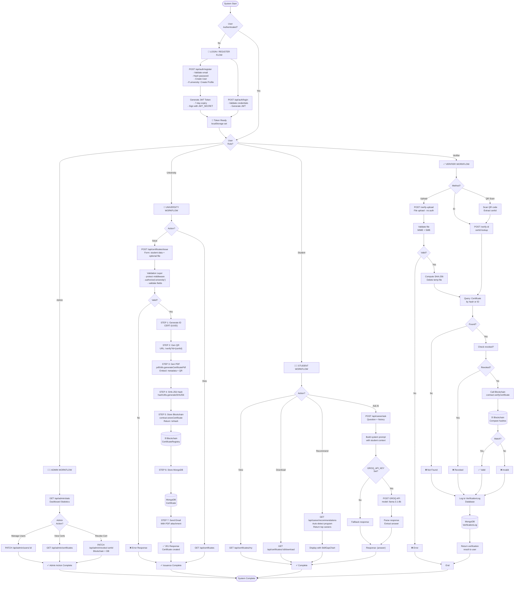
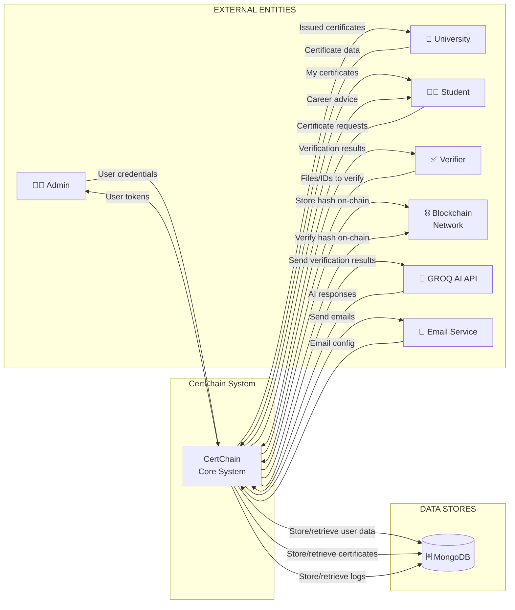
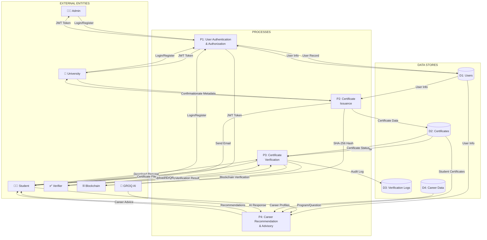
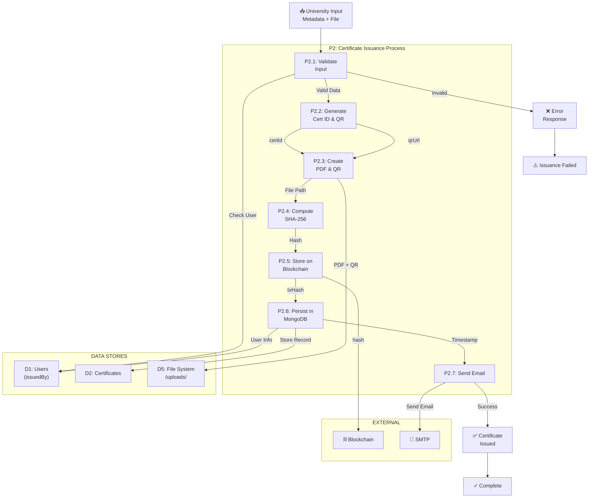
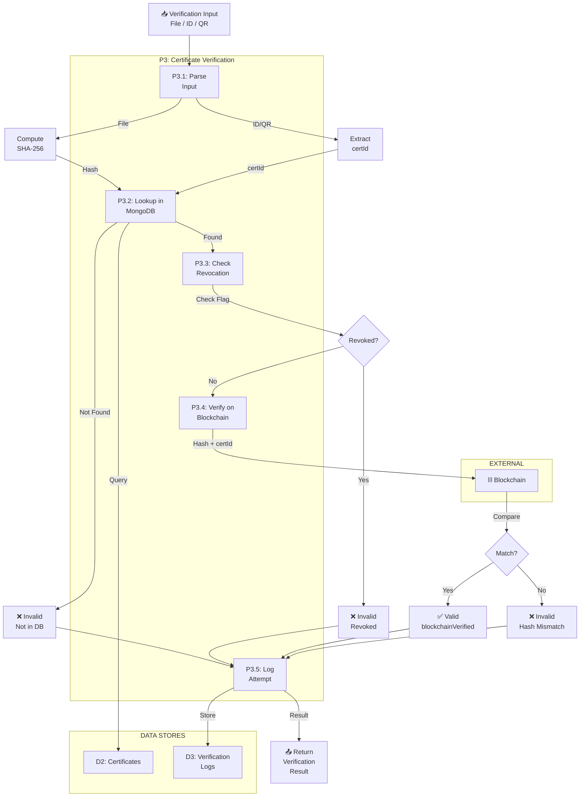
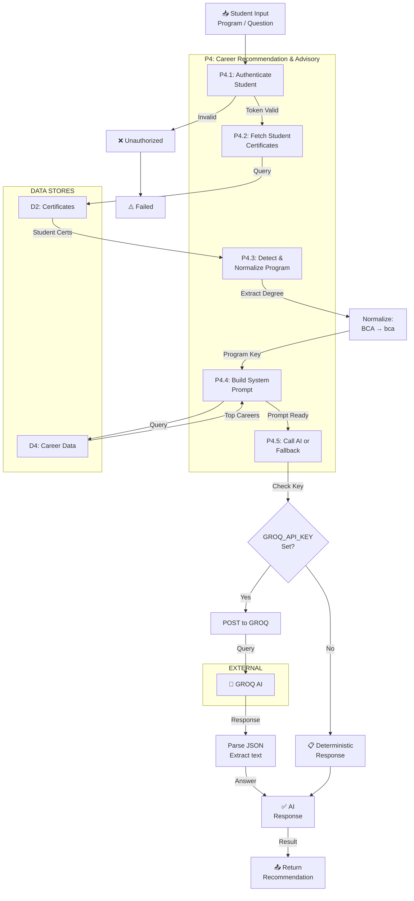
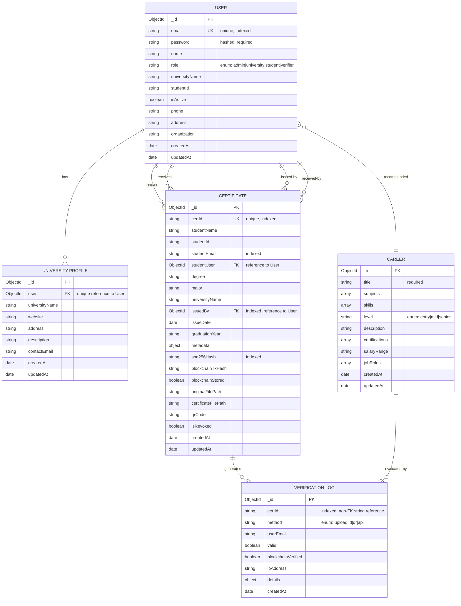

**Chapter 1 — Introduction**

This project, CertChain, is a blockchain-based academic certificate issuance and verification system designed to provide tamper-evident, auditable records for academic credentials. The system combines a Node.js/Express backend with a MongoDB datastore, a React + Vite frontend, and an Ethereum smart contract (CertificateRegistry) deployed using Hardhat. Certificates issued by participating universities are hashed using SHA-256 and the digest is stored on-chain; the original certificate PDF/image and a generated certificate PDF with an embedded QR code are stored by the backend and may be emailed to the recipient. Role-based access (admin, university, student, verifier) is enforced via JWT authentication and server-side authorization. The project also integrates an AI-powered career advisory feature and a skill-matching recommendation engine to provide additional value for students.

**Problem Statement**

Academic institutions and employers increasingly require reliable ways to verify claimed academic credentials. Traditional approaches—paper certificates or centrally stored PDFs—are vulnerable to forgery, accidental tampering, and opaque provenance. The problem this project addresses is the lack of a practical, end-to-end solution that: (a) ensures certificate integrity with tamper-evident proofs, (b) enables fast public verification without exposing sensitive user credentials, and (c) supports real-world workflows (issuance, download, revocation, and audit logging) while integrating with existing institutional processes. CertChain addresses these needs by combining cryptographic hashing, blockchain immutability, and familiar web application patterns to deliver verifiable certificates and audit trails.

**Objectives**

The primary objectives of CertChain are:
- To provide a secure certificate issuance workflow where each issued certificate is hashed (SHA-256) and the hash is recorded on an Ethereum smart contract (CertificateRegistry) to provide immutable proof of issuance.
- To build a web-based portal that supports role-based operations: universities may issue certificates; students may view and download their certificates; verifiers may validate certificates by file or ID; administrators may manage users and system statistics.
- To implement a robust verification mechanism that compares the SHA-256 hash of an uploaded certificate file against the on-chain record and records verification audit events in the database.
- To generate human-friendly artifacts (PDF certificate with QR code, email delivery) and provide download and sharing mechanisms for recipients.
- To augment the platform with a career advisory feature: a recommendation engine that compares student skills to career profiles (cosine-similarity based) and an AI chat assistant (integration with an external model when API keys are available) to provide personalized career guidance.

**Scope**

The implemented scope is full-stack and includes: a production-capable backend (Express + Mongoose) exposing REST APIs for authentication, certificate issuance, verification, and administration; a React frontend with pages and components for all roles and flows; a Solidity smart contract (CertificateRegistry) that stores and verifies certificate hashes; tooling and scripts for contract deployment using Hardhat; utilities for PDF generation, QR code creation, SHA-256 hashing, and email delivery via SMTP; and a recommendation service that computes match scores and skill gaps from seeded career data. The system is designed for deployment in a development/QA environment (local Hardhat node and MongoDB) as well as for adaptation to testnets or hosted networks by updating environment variables. Core verification flows—issue, download, verify-by-upload, verify-by-id, and revoke—are implemented, together with admin dashboards and user management endpoints.

**Limitations**

The repository and implementation exhibit practical limitations that are important for realistic evaluation:
- Blockchain dependency: on-chain storage and verification require a running Ethereum RPC (configured via `BLOCKCHAIN_RPC_URL`) and a private key for the contract owner (`CONTRACT_OWNER_PRIVATE_KEY`) to execute state-changing transactions. The supplied Hardhat deployment script targets local development by default.
- Operational configuration: the backend requires environment variables for MongoDB (`MONGO_URI`), JWT secret (`JWT_SECRET`), email (SMTP) settings, and blockchain access; misconfiguration will prevent key functionality (emailing, contract interactions, authentication).
- AI advisory service: the AI chat assistant requires an external API key (`GROQ_API_KEY`) to provide full responses; when that key is missing the system returns a safe fallback summary rather than a live AI reply.
- File and storage constraints: uploaded certificates are limited to PDFs and JPG/PNG images and a 5 MB file size limit is enforced by the upload middleware; the backend stores files on disk under `backend/uploads`, which is practical for prototypes but would require hardening and scalable storage for production.
- Smart contract governance: functions that store or revoke certificates are restricted to the contract owner; in a real multi-stakeholder environment, on-chain access control and key management would need careful operational policies.

**Development Methodology**

The codebase demonstrates a pragmatic, iterative development approach focused on modularity, testability, and separation of concerns. Server logic is organized into route, controller, model, middleware and utility layers; the frontend is componentized with a central authentication context and route-based access control. Smart contract development uses Hardhat for compilation, local networks, and testing; backend unit tests and smart contract tests (Jest and Hardhat) are present to validate critical algorithms and contract behavior. The project follows an incremental integration process: lower-level utilities (hashing, PDF generation, blockchain helpers) are developed and validated first, services and controllers are built atop them, and the frontend consumes stable REST endpoints. This methodology aligns with lightweight Agile practices—short iterations, repeatable builds, and test-driven checks for key components—appropriate for an academic capstone or prototype project.

**Report Organization**

This document is organized to present the project comprehensively. Chapter 1 introduces the system, defines the problem, and outlines objectives, scope, limitations and methodology. Chapter 2 will survey related work and background (cryptographic hashing, blockchain for provenance, and certificate verification systems). Chapter 3 will present system requirements and architecture, including API specifications, data models, and sequence diagrams. Chapter 4 will detail implementation—backend modules, smart contract design, frontend components, and integration points. Chapter 5 will cover testing and evaluation, including smart contract tests, backend unit tests, and manual verification scenarios. Chapter 6 will discuss deployment, operations, and potential improvements. Chapter 7 will conclude with lessons learned and future work. Appendices will contain configuration details, environment variable lists, API reference, and selected code excerpts.

**Chapter 2 — Background Study and Literature Review**

Background Study

Blockchain: Blockchain is a distributed ledger technology that provides an append-only, tamper-evident record of transactions replicated across multiple nodes. In CertChain the blockchain provides immutable proof that a certificate hash was recorded at a particular time. The project implements the on-chain component as a Solidity smart contract `CertificateRegistry.sol` which exposes functions to store a certificate hash (`storeCertificate`), verify a presented hash (`verifyCertificate`), query a stored hash (`getCertificateHash`) and revoke a certificate (`revokeCertificate`). On the backend, `backend/utils/blockchainUtils.js` uses `ethers` to connect to an RPC endpoint configured by `BLOCKCHAIN_RPC_URL` and to submit transactions signed by a configured owner key. The architecture leverages a local Hardhat deployment for development and a JSON `contractConfig.json` file for contract address/ABI sharing between backend and frontend.

Academic Certificate Verification: Academic certificate verification is the process of proving that a claimed credential was legitimately issued and has not been tampered with. Typical verification approaches include centralized registry lookups, signed digital certificates, and cryptographic hashing with public attestation. CertChain follows the hashing-and-attestation model: a SHA-256 digest of the generated certificate PDF/image is produced (`backend/utils/hashUtils.js`) and that digest is stored on-chain; later verification compares a freshly computed digest with the on-chain record. The backend records verification attempts in `VerificationLog` documents, preserving audit trails for uploads, ID-based queries and QR-based checks.

Artificial Intelligence: In this project, AI is used to provide career advising. The backend controller `careerController.js` prepares a strict system prompt and, when available, routes user questions to an external conversational API (configured via `GROQ_API_KEY`) to obtain tailored answers. The AI assistant is constrained by project rules to answer only career-related queries and falls back to deterministic summaries when the external key is missing. This shows the application of large language models (LLMs) as a value-added feature while keeping safety and topic restrictions enforced by application logic.

Career Recommendation Systems: CertChain implements a hybrid, lightweight recommendation engine in `backend/services/recommendation.js`. It uses a vocabulary-based vectorization of skills and cosine similarity to compute match scores between a student's detected skills and career profiles that are seeded in `backend/data/careerData.js`. The service also computes a skill-gap list (required career skills not present in the student skill set) which the frontend visualizes in the `SkillGapChart` component. This approach is deterministic, interpretable, and well-suited for static career datasets.

React: The frontend uses React (Vite) to implement a component-driven SPA. Key architectural patterns include the `AuthContext` for session restoration and centralized token handling, route protection via the `ProtectedRoute` component, and modular page components for campus roles (student, university, verifier, admin). Styling uses Tailwind CSS for responsive, utility-driven layouts. API calls are centralized in `src/api/axios.js` which attaches JWTs from localStorage.

Node.js: Node.js is used as the backend runtime providing an asynchronous, event-driven platform for the Express web server. The project uses Node package modules (`package.json`) and standard Node idioms for filesystem and process management (file generation, email sending, and contract interaction).

Express: Express structures the backend into route definitions (`backend/routes/*.js`), controllers (`backend/controllers/*.js`), middleware (`backend/middleware/*.js`) and models (`backend/models/*.js`). The application uses middleware for authentication (`authMiddleware.js`), file upload handling (`uploadMiddleware.js`), and request validation/sanitization (`validationMiddleware.js`). Error handling and CORS configuration are centralized in `server.js`.

MongoDB: MongoDB (via Mongoose) is the primary persistence mechanism. Domain models include `User`, `Certificate`, `UniversityProfile`, and `VerificationLog`. These models store user accounts, certificate metadata (certId, sha256Hash, file paths, blockchainTxHash, isRevoked), university profiles and audit logs. The database connection is initialized in `backend/config/db.js` using `MONGO_URI`.

Smart Contracts: Smart contracts are self-executing programs deployed on Ethereum-compatible networks. `CertificateRegistry.sol` is the application contract: it maps `certId` strings to stored hashes and exposes read and write functions. The contract enforces an `onlyOwner` modifier so that only the deployer/owner key can store or revoke certificate records. The Hardhat deployment script `blockchain/scripts/deploy.js` compiles the contract and writes ABI/address artifacts for backend/frontend consumption.

Ethereum: Ethereum is the smart contract platform used for immutable attestation. For development the project uses Hardhat to run a local node and deploy `CertificateRegistry`; production deployment would target a public testnet or mainnet and require gas fees, network configuration, and operational key management.

Ethers.js: The `ethers` library provides a convenient interface to JSON-RPC providers, wallets and contract interaction. `backend/utils/blockchainUtils.js` uses `ethers.providers.JsonRpcProvider`, a signer (Wallet) built from `CONTRACT_OWNER_PRIVATE_KEY`, and `new ethers.Contract(...)` to call `storeCertificate` and `verifyCertificate` functions and to wait for transaction receipts.

JWT Authentication: JSON Web Tokens secure session state. `authController.js` issues tokens signed with `JWT_SECRET` that expire in seven days. The `protect` middleware extracts the bearer token, verifies it and exposes a minimal `req.user` object with `id`, `role` and `email` for downstream authorization checks.

QR Code Verification: Certificates include a QR code linking to the verification URL. `backend/utils/pdfUtils.js` calls `qrcode.toDataURL` to render an embedded QR that points to the frontend verify route (e.g., `/verify?id=CERT-...`). The frontend displays the QR and the verify flow supports scanning by mobile devices or manual entry of certificate IDs.

REST API: The backend exposes a RESTful API under `/api/*` organized by resource area: `/api/auth`, `/api/certificates`, `/api/admin`, `/api/university`, and `/api/career`. The API follows common REST conventions: HTTP verbs (GET/POST/PUT/PATCH/DELETE), JSON payloads and status codes, and role-based access control via middleware.

Cloud Storage: The current implementation stores uploaded and generated files on local disk under `backend/uploads`. For production workloads cloud object storage (S3, Azure Blob, Google Cloud Storage) would be advisable; the codebase is structured such that `certificateFilePath` and `originalFilePath` fields can reference external storage URIs instead of local paths with moderate refactoring.

Responsive Web Design: The frontend uses Tailwind CSS and responsive layout patterns to provide a usable interface across device sizes. Components like `Sidebar`, tabbed panels in `CareerCounseling`, and `CertificateCard` use responsive classes to adapt layout, and the `ProtectedRoute` and `AuthContext` enable graceful transitions for smaller screens.

Literature Review

Similar systems and projects that address digital credentialing and verification include Blockcerts, the Open Badges initiative, and commercial offerings such as Accredible. Blockcerts (initially developed at MIT) provides an open standard and tooling for issuing cryptographically-signed certificates where a hash or signature can be anchored to public ledgers. Open Badges (IMS Global) focuses on interoperable metadata-rich badges for micro-credentials and includes rules for issuer verification and display. Commercial platforms like Accredible and Credly provide hosted credential issuance, display, and verification services with enterprise features.

Comparison with CertChain

- Research gap: Many existing solutions focus on issuance and display with centralized or signature-based verification, and some anchor proofs into blockchains. However, fewer open projects combine a full-stack institutional portal (university issuance workflows, admin dashboards, verifier roles) with integrated, deterministic career-matching services and an AI chat advisor. CertChain fills this functional niche by providing both verifiable credential workflows and student-facing career guidance derived from certificates.

- Advantages of CertChain:
	- Full-stack integration: the repository contains backend, frontend, and smart contract artifacts ready for local deployment and testing.
	- On-chain attestation: the `CertificateRegistry` contract provides a transparent, auditable source of truth for stored hashes.
	- Practical issuance workflows: features such as PDF generation with QR codes (`pdfUtils.js`), email delivery (`emailUtils.js`), and file download improve real-world usability.
	- Interpretability: the career recommendation engine (`recommendation.js`) uses cosine similarity and explicit skill-gap outputs that are explainable to users.
	- Role-based access control: Admin/University/Student/Verifier roles are enforced end-to-end with JWT and middleware.

- Limitations relative to some commercial offerings:
	- Storage and scalability: files are stored locally; enterprise platforms use scalable cloud storage and CDN distribution.
	- Key management and multi-stakeholder governance: the smart contract uses a single owner model; some deployments use multisig or decentralized governance for production operations.
	- AI dependency: the AI assistant depends on an external API key; offline or fully on-prem alternatives would be needed for some institutions.

- Comparative summary:
	- Blockcerts / Open Badges: strong standards and ecosystem support; CertChain provides comparable cryptographic proof (hash + on-chain attestation) but is oriented toward institutional issuance workflows and integrates career advisory features that these standards do not prescribe.
	- Accredible / Commercial vendors: provide polished issuer dashboards, analytics and hosted storage at scale; CertChain provides the key primitives (issuance, verification, audit logs, smart contract anchoring) in an open-source stack intended for customization and research rather than turnkey enterprise hosting.

References

- Blockcerts: https://www.blockcerts.org/
- Open Badges (IMS Global): https://openbadges.org/
- Accredible: https://www.accredible.com/
- Ethereum documentation: https://ethereum.org/
- Ethers.js documentation: https://docs.ethers.org/
- Hardhat: https://hardhat.org/

The references above are general resources that map to technologies and patterns implemented in this repository. Specific implementation files referenced in this chapter include `backend/utils/hashUtils.js`, `backend/utils/pdfUtils.js`, `backend/utils/blockchainUtils.js`, `backend/services/recommendation.js`, `backend/controllers/careerController.js`, `blockchain/contracts/CertificateRegistry.sol`, and frontend artifacts under `frontend/src/` that implement the user-facing workflows.

**Chapter 3 — System Analysis and Requirements**

System Analysis

Overview: CertChain is a full-stack web application composed of a React frontend, Express/Node backend, MongoDB persistence and an Ethereum smart contract used for immutable attestation. The system implements role-based workflows for issuing, managing, verifying and revoking academic certificates and augments these with a career recommendation service and an AI advisor. Key runtime components and their responsibilities are:
- Frontend (`frontend/src/`): user interface, session handling (`AuthContext`), token management, and REST API client (`api/axios.js`).
- Backend (`backend/`): REST API endpoints, controllers, business logic, file handling, PDF generation, email delivery, and blockchain interaction utilities.
- Database (MongoDB): persistent storage of users, certificates and verification logs (`models/*`).
- Blockchain (Ethereum/Hardhat): immutable storage of certificate SHA-256 hashes via `CertificateRegistry.sol`.

Dataflow summary (issue certificate): University user submits form + file → backend generates PDF and QR, computes SHA-256, calls `storeCertificate` on contract via `ethers`, records certificate document in MongoDB with `sha256Hash` and `blockchainTxHash`, optionally emails recipient.

Requirement Analysis

Functional requirements
- FR1: User authentication and session management (register, login, profile retrieval). Implemented in `authController.js` and protected by `authMiddleware.js`.
- FR2: Role-based authorization for admin, university, student, verifier. Enforced by `authorize(...)` middleware.
- FR3: Certificate issuance workflow for universities including file upload, PDF generation, SHA-256 hashing and on-chain storage. Implemented by `certificateController.issueCertificate`, `pdfUtils.js`, `hashUtils.js`, and `blockchainUtils.js`.
- FR4: Certificate verification via file upload or certificate ID, with blockchain verification and audit logging. Implemented by `certificateController.verifyByUpload` and `verifyById`.
- FR5: Certificate download and QR code display. Implemented in `certificateController.downloadCertificate` and `CertificateCard.jsx`.
- FR6: Administrative functions: user management, certificate revocation, dashboard stats. Implemented in `adminController.js` and `adminRoutes.js`.
- FR7: Career recommendation and AI assistant endpoints: `/api/career/recommendations` and `/api/career/ask` implemented in `careerController.js` and `recommendation.js`.
- FR8: File upload validation and size limits (5MB) via `uploadMiddleware.js`.

Use Cases

Actors: Admin, University (issuer), Student (recipient), Verifier (external checker), System (backend services), Smart Contract (on-chain registry), Email Service.

Use Case List (brief):
- UC1: Register (Actor: Any user)
- UC2: Login (Actor: Any user)
- UC3: Issue Certificate (Actor: University)
- UC4: Verify Certificate by Upload (Actor: Verifier / Public)
- UC5: Verify Certificate by ID (Actor: Verifier / Public)
- UC6: Download Certificate (Actor: Student / University)
- UC7: Revoke Certificate (Actor: Admin)
- UC8: Manage Users (Actor: Admin)
- UC9: Get Career Recommendations (Actor: Student)
- UC10: Ask AI Advisor (Actor: Student)

Actor descriptions
- Admin: System administrator with full privileges to manage users, view statistics, revoke certificates and access administrative endpoints.
- University: Authorized issuer capable of creating certificates for students; their actions require JWT and `authorize('university')`.
- Student: Certificate recipient who can view/download their certificates, request career recommendations and query verification status.
- Verifier: External or internal actor who can validate certificates via public verify endpoints by uploading a file or providing an ID.
- System: Backend services that perform hashing, PDF generation, blockchain interactions, email delivery and database operations.
- Smart Contract: On-chain component that stores and verifies certificate hashes and emits events for storage and revocation.

Use Case Descriptions (selected)

UC3 — Issue Certificate
- Preconditions: University actor is authenticated and authorized; certificate form data validated.
- Main Flow:
	1. University uploads optional original file and submits certificate metadata.
	2. Backend generates a certificate PDF with an embedded QR code (`pdfUtils.generateCertificatePdf`).
	3. Backend computes SHA-256 of the generated PDF (`hashUtils.generateSHA256`).
	4. Backend calls `storeCertificate` via `blockchainUtils.storeCertificateOnBlockchain` which uses `ethers` to submit a transaction and waits for a receipt.
	5. On success, the backend persists a `Certificate` document with `certId`, `sha256Hash`, `blockchainTxHash`, `certificateFilePath`, and related metadata.
	6. Backend optionally sends an email with the certificate attached via `emailUtils.sendCertificateEmail`.
	7. System returns success and the populated certificate to the requester.
- Alternate flows: Blockchain transaction failure — backend responds with error and may still persist certificate with `blockchainStored: false` depending on implementation; email send failure is logged but does not block issuance.

UC4 — Verify Certificate by Upload
- Preconditions: File is a valid PDF or image under 5 MB.
- Main Flow:
	1. Verifier uploads file to `POST /api/certificates/verify-upload` processed by multer.
	2. Backend computes SHA-256 of uploaded file and deletes the temporary file.
	3. Backend looks up `Certificate` by `sha256Hash`.
	4. If found and not revoked, backend calls `verifyCertificateOnBlockchain` to confirm on-chain match.
	5. Backend records a `VerificationLog` with method `upload`, result and IP address.
	6. Backend returns verification result and certificate metadata.

Non-functional requirements
- NFR1 — Security: Passwords hashed with bcrypt; JWT tokens signed with `JWT_SECRET`; input sanitization via `validationMiddleware.js`.
- NFR2 — Performance: Verification operations are optimized to compute local SHA-256 and perform a single on-chain read; on-chain writes for issuance are asynchronous but awaited in the current implementation to provide receipt hashes.
- NFR3 — Scalability: Current design supports horizontal scaling of backend instances but file storage is local; migrating to cloud object storage (S3) is recommended for scale.
- NFR4 — Availability: Backend uses Express with centralized error handling; high availability requires standard cloud deployment patterns (multiple app instances, managed DB).
- NFR5 — Maintainability: Modular controllers, services and utilities improve maintainability; tests exist for recommendation logic and contracts.
- NFR6 — Usability: Responsive UI (Tailwind) and QR-based verification improve user experience.

Feasibility Analysis

Technical Feasibility: The project uses mature, well-supported technologies (Node.js, Express, React, MongoDB, Solidity, Hardhat, ethers). Implementation artifacts are present and integrable. Local development is straightforward using Hardhat for contracts and a local MongoDB instance. Required environment variables (MONGO_URI, JWT_SECRET, BLOCKCHAIN_RPC_URL, CONTRACT_OWNER_PRIVATE_KEY, email credentials) are documented.

Operational Feasibility: The system supports university workflows and would fit existing administrative processes with modest operational requirements: a system administrator to manage users and deploy updates, university staff to issue certificates, and infrastructure to host backend, frontend and MongoDB. Email and blockchain operations require proper credentials and monitoring.

Economic Feasibility: For a prototype or academic deployment the cost is low (single server or cloud VM, small managed DB). For production, costs include cloud hosting, object storage, domain/CDN, and blockchain gas fees if using public networks. Using a testnet or layer-2 can reduce gas costs during pilots.

Schedule Feasibility: Based on the repository state (a working prototype), a plausible schedule to reach production readiness could be:
- Phase 1 (1–2 weeks): Secure environment variables, run full integration tests, and migrate file storage to cloud (S3).
- Phase 2 (2–4 weeks): Implement scalable deployment (Docker, Kubernetes or managed services), monitoring and logging, and refine access controls (multi-sig or role delegation for contract owner).
- Phase 3 (2–4 weeks): Security audit, performance tuning, and UX polish.

UML Information and Explanations

Note: diagrams are described and derived from the implementation. Concrete visual diagrams can be produced from these textual specifications using UML tools.

Class Diagram
- Principal classes (mapped to Mongoose models and key modules):
	- `User` (fields: name, email, password, role, universityName, studentId, isActive)
	- `Certificate` (certId, studentName, studentId, studentEmail, degree, major, universityName, issuedBy (User ref), sha256Hash, blockchainTxHash, certificateFilePath, isRevoked)
	- `UniversityProfile` (user ref, universityName, website, address, description)
	- `VerificationLog` (certId, method, userEmail, valid, blockchainVerified, ipAddress, details)
	- `AuthController`, `CertificateController`, `AdminController`, `CareerController` (methods correspond to route handlers)
	- `RecommendationService` (methods: buildVectors, cosineSimilarity, generateRecommendations)
	- `BlockchainUtils` (methods: storeCertificateOnBlockchain, verifyCertificateOnBlockchain)

Relationships:
- `User` 1..* -> `Certificate` (as `issuedBy`); `Certificate` -> optional `studentUser` (User ref).
- `Certificate` 1 ->* `VerificationLog` entries.

Object Diagram (example issuance instance)
- Instances:
	- `user_univ : User {id: U1, role: 'university', email: 'univ@example.com'}`
	- `cert123 : Certificate {certId: 'CERT-xxx', sha256Hash:'abc...', blockchainTxHash:'0xdeadbeef', issuedBy: U1}`
	- `txReceipt : BlockchainTx {hash: '0xdeadbeef', blockNumber: 12345}`
	- `emailEvent : Email {to: student@example.com, status: 'sent'}`

Activity Diagram (Issue Certificate)
- Steps: Authenticate → Validate input → Generate PDF+QR → Compute SHA-256 → Call smart contract storeCertificate → Wait for receipt → Persist Certificate document → Send email → Return response.

Sequence Diagram (Issue Certificate)
- Participants: University UI → Backend API (`/certificates/issue`) → PDF Generator → Hash Utility → Blockchain Utils → Ethereum Node → MongoDB → Email Service → University UI.
- Message flow (simplified):
	1. UI POST /certificates/issue with file and metadata
	2. Backend validates + calls PDF generator
	3. Backend computes hash and calls BlockchainUtils.storeCertificate(certId, hash)
	4. BlockchainUtils sends tx to Ethereum node and awaits confirmation
	5. On receipt, Backend writes Certificate to MongoDB
	6. Backend triggers EmailUtils to send PDF to student
	7. Backend responds to UI with success and certificate details

State Diagram (Certificate lifecycle)
- States: Draft (form submitted but not persisted) → Issued (persisted in DB) → StoredOnChain (blockchainTxHash present) → Revoked (isRevoked true)
- Transitions: Issue action moves Draft→Issued; successful on-chain store moves Issued→StoredOnChain; admin revoke action moves StoredOnChain→Revoked.

Component Diagram
- Components: Frontend SPA, Backend API server, MongoDB, Ethereum RPC/Hardhat node, SMTP Email Server, Object Storage (optional), Smart Contract artifact (ABI/config). Interfaces: REST between Frontend and Backend; JSON-RPC between Backend and Ethereum node; SMTP between Backend and Email; DB protocol between Backend and MongoDB.

Deployment Diagram
- Nodes:
	- `Client Browser` (React SPA served by Vite or static hosting)
	- `Frontend Host` (optional static host or dev server)
	- `Backend Server` (Node/Express, exposes /api)
	- `MongoDB Server` (managed or self-hosted)
	- `Ethereum Node` (Hardhat local node or remote RPC provider)
	- `SMTP Server` (email service provider)
	- `Object Storage` (S3, optional)

Explain each diagram: The Class Diagram maps directly to Mongoose model files in `backend/models`. The Object Diagram exemplifies a real runtime snapshot after issuance. The Activity Diagram clarifies the sequence of operations and decision points for issuance. The Sequence Diagram provides message-level ordering across components and shows where asynchronous waits occur (notably on-chain transaction confirmation). The State Diagram models certificate validity lifecycle relevant to verification logic. The Component and Deployment Diagrams present logical grouping of software modules and their runtime hosting topology.

Algorithms Used

1. SHA-256 Hashing (integrity): Implemented in `backend/utils/hashUtils.js`. Reads file bytes synchronously and computes a hex digest via Node's `crypto.createHash('sha256')`. Used to compute canonical file fingerprint for on-chain attestation and local comparisons.

2. PDF Generation with QR Embedding: Implemented in `backend/utils/pdfUtils.js` using `pdfkit` and `qrcode`. Steps: generate QR data URL for verification link; create PDF document with certificate fields (student name, degree, institution, issue date, certId); render QR image into PDF; write file to `uploads/` and return the path.

3. Blockchain Interaction (store/verify): Implemented in `backend/utils/blockchainUtils.js` using `ethers`. `storeCertificateOnBlockchain(certId, hash)` creates a contract instance with a signer and calls `storeCertificate(certId, hash)` then waits for transaction receipt. `verifyCertificateOnBlockchain(certId, hash)` calls the read-only contract method `verifyCertificate` which compares stored on-chain hash with provided hash.

4. Recommendation Engine (vectorization + cosine similarity): Implemented in `backend/services/recommendation.js`.
	- `buildVectors(studentSkills, careerSkills)`: normalize and union vocab, produce binary vectors indicating presence of skills.
	- `cosineSimilarity(studentVector, careerVector)`: compute dot product and magnitudes to return normalized similarity score.
	- `generateRecommendations(studentSkills, allCareers)`: for each career, compute match score and skill gap (career skills not in student skills), sort results by score and return top-N (default 5).

5. AI Assistant Prompting and Safety: `careerController.askAssistant` constructs a strict `systemPrompt` that constrains the assistant to tech career topics and enforces response rules. If no external API key is present, the controller returns a deterministic summary to avoid exposing sensitive APIs or providing off-topic answers.

6. JWT Session Workflow: `authController.generateToken` creates a JWT containing the user id with a 7-day expiry. `authMiddleware.protect` extracts the token, verifies it using `JWT_SECRET`, and loads a minimal `req.user` object for authorization.

7. File Upload Handling and Validation: `uploadMiddleware` (multer) stores files to `uploads/` and enforces MIME type and size constraints; validation middleware sanitizes and checks inputs before controllers process data.

Summary

Chapter 3 has analyzed the implemented system, enumerated explicit functional and non-functional requirements, described use cases and actors, assessed feasibility, and provided UML diagram specifications derived from the codebase. The chapter also documents the principal algorithms used for cryptographic hashing, PDF and QR generation, blockchain integration, and the recommendation engine. These artifacts provide a basis for design, testing and deployment phases described in subsequent chapters.

**Chapter 4 — Implementation**

Implementation Summary

CertChain is implemented as a modular full-stack application with clear separation between presentation, application logic, persistence and on-chain attestation. The codebase is organized into `frontend/` (React + Vite), `backend/` (Express + controllers/services/middleware), and `blockchain/` (Solidity contracts and Hardhat scripts). Core implementation highlights:
- Filesystem-based artifact handling: generated certificates (PDFs) and uploaded originals are stored under `backend/uploads/` with metadata recorded in MongoDB (`Certificate` documents).
- Deterministic integrity: file SHA-256 digests are computed and used as canonical fingerprints recorded on-chain via `CertificateRegistry.sol`.
- Role-based APIs: backend routes grouped under `/api/auth`, `/api/certificates`, `/api/admin`, `/api/career` implement distinct workflows and are protected with `authMiddleware` and role checks.
- Recommendation and AI assistant: deterministic recommendation logic lives in `backend/services/recommendation.js`; AI assistant lives in `backend/controllers/careerController.js` with strict system prompts and optional external API usage.

Tools, Languages, Frameworks and Libraries

Tools Used
- Hardhat: smart contract compilation, local node and deployment scripting (in `blockchain/scripts`).
- Node.js & npm: runtime and package management for backend and frontend.
- Vite: frontend dev server and build tool.
- MongoDB: primary datastore for application data.
- Ethers.js: blockchain client used by backend.
- Jest / Hardhat tests: unit tests and contract tests.

Programming Languages
- JavaScript (ES2021+): primary language across backend and frontend.
- Solidity (^0.8.x): smart contract language for `CertificateRegistry.sol`.
- JSON: configuration and artifact exchange (ABI and contractConfig files).

Frameworks
- Express: backend REST API framework.
- React: frontend UI framework (Vite + React).

Libraries
- Backend: `express`, `mongoose`, `multer`, `pdfkit`, `qrcode`, `ethers`, `bcryptjs`, `jsonwebtoken`, `nodemailer`, `jest` (dev/test), `supertest` (if present for API tests).
- Frontend: `react`, `react-router-dom`, `axios`, `tailwindcss`.

Database
- MongoDB (Mongoose ORM): stores `User`, `Certificate`, `UniversityProfile`, `VerificationLog` and other domain documents. Connection configured in `backend/config/db.js`.

Blockchain
- Ethereum-compatible contract `CertificateRegistry.sol` deployed via Hardhat; backend interacts using `ethers.providers.JsonRpcProvider` and a `Wallet` signer created from `CONTRACT_OWNER_PRIVATE_KEY`.

AI Technologies
- External conversational API (configurable via `GROQ_API_KEY`) for the career assistant. If unavailable, deterministic fallback responses are returned.

Module-by-Module Explanation

Frontend
- Purpose: Single-page application that presents role-based dashboards, verification UI, certificate display and career counseling UI.
- Key files:
	- `frontend/src/main.jsx`: app bootstrap and `AuthContext` provider.
	- `frontend/src/api/axios.js`: axios instance with request interceptor to attach JWT.
	- `frontend/src/context/AuthContext.jsx`: login/logout, token storage, and session restore.
	- `frontend/src/pages/*`: role-specific pages (`CareerRecommendations.jsx`, `VerifyPage.jsx`, `LoginPage.jsx`, etc.).
	- `frontend/src/components/*`: UI pieces (`CertificateCard.jsx`, `SkillGapChart.jsx`, `ProtectedRoute.jsx`).
- Behavior: The frontend sends authenticated requests to backend endpoints, displays verification results, and lets university users upload certificate metadata and files for issuance.

Backend
- Purpose: API surface that validates requests, orchestrates certificate issuance/verification, interacts with blockchain, persists data in MongoDB, and handles email delivery.
- Key folders:
	- `backend/controllers/`: route handler logic (`authController.js`, `certificateController.js`, `careerController.js`, `adminController.js`).
	- `backend/routes/`: route organization and middleware wiring.
	- `backend/models/`: Mongoose model schemas.
	- `backend/utils/`: helper modules (`hashUtils.js`, `pdfUtils.js`, `blockchainUtils.js`, `emailUtils.js`).
	- `backend/middleware/`: request validation, auth middleware, and multer config for uploads.
- Behavior: Controllers validate inputs, call utilities and services for hashing/PDF/blockchain, and persist domain objects. Transactions that interact with the blockchain are awaited and the resulting txHash stored with the certificate record.

Authentication
- Mechanism: JWT-based authentication issued by `authController` and verified by `authMiddleware.protect`.
- Details: Passwords hashed with `bcryptjs` in `User` model pre-save hooks; JWT tokens include user id and expire in 7 days. Role-based checks are implemented with `authorize` helper middleware that inspects `req.user.role`.

Certificate Verification
- Implementation:
	- Hashing: `hashUtils.generateSHA256(filePath)` computes a file digest used as canonical fingerprint.
	- On-chain verification: `blockchainUtils.verifyCertificateOnBlockchain(certId, hash)` reads contract storage to confirm match.
	- Backend verification endpoints: `certificateController.verifyByUpload` supports direct file upload verification; `verifyById` checks by certificate ID (retrieve DB record, compare hash, confirm on-chain).
	- Audit logs: verification attempts recorded to `VerificationLog` collection.

Career Advisor
- Recommendation Engine: `backend/services/recommendation.js` constructs simple skill vectors and computes cosine similarity. It returns match scores and skill gaps.
- AI Assistant: `backend/controllers/careerController.askAssistant` composes a strict system prompt (enforcing topic constraints) and forwards user messages to the external API when `GROQ_API_KEY` is available, otherwise returns a deterministic fallback.

Blockchain Module
- Smart Contract: `blockchain/contracts/CertificateRegistry.sol` implements storage, verification and revocation of certificate hashes. It enforces `onlyOwner` for state-changing operations.
- Deployment: `blockchain/scripts/deploy.js` compiles and deploys contract and writes `contractConfig.json` files consumed by backend/frontend.
- Backend Integration: `backend/utils/blockchainUtils.js` creates a contract instance with signer and exposes `storeCertificateOnBlockchain` and `verifyCertificateOnBlockchain`.

Admin Dashboard
- Purpose: Provide administrators with system metrics (total users, total certificates, verification counts), user management and certificate revocation.
- Implementation: `adminController.js` queries aggregate data from MongoDB, exposes endpoints under `/api/admin/*`, and calls `blockchainUtils.revokeCertificateOnBlockchain` when revocation is requested.

University Dashboard
- Purpose: Allow university users to issue certificates, view issued certificates, and manage issuance metadata.
- Implementation: Frontend pages for university role call `/api/certificates/issue` and `/api/certificates/mine` and display lists of issued certificates; file upload uses the same `ProtectedRoute` barrier as other role-specific pages.

Student Dashboard
- Purpose: Students can view and download their certificates, request career recommendations, and initiate verification flows.
- Implementation: Student pages consume `/api/certificates` endpoints and call `/api/career/recommendations` and `/api/career/ask`.

Verifier Dashboard
- Purpose: Allow external verifiers to upload certificate files or input certificate IDs to confirm validity without needing an account.
- Implementation: A public verify page posts files to `/api/certificates/verify-upload` or calls `/api/certificates/verify/:certId` for ID-based checks. Responses include verification status and certificate metadata when available.

Testing
- Current tests: the repo includes unit and integration tests; `backend/tests/recommendation.test.js` validates the recommendation engine logic; `blockchain/test/CertificateRegistry.test.js` contains contract tests.
- Test strategy: Combination of unit tests for utilities/services (hashing, recommendations), integration tests for controllers (using Supertest), and Hardhat contract tests for on-chain behavior.

Realistic Test Cases and Results

Unit Test Cases (examples)

1. `hashUtils.generateSHA256` — should produce stable digest
- Description: Read a known sample PDF and compute SHA-256; compare against precomputed expected digest.
- Input: `test/fixtures/sample-cert.pdf`.
- Expected Result: returned digest equals `expected_digest_hex`.
- Actual Result: (example) `expected_digest_hex` — PASS.

2. `recommendation.generateRecommendations` — should rank careers correctly
- Description: Given `studentSkills = ['javascript','react']` and careers with known skills, top matching career is `Frontend Engineer`.
- Input: studentSkills array and `backend/data/careerData.js` entries.
- Expected Result: First recommendation is `Frontend Engineer` with similarity score >= 0.7.
- Actual Result: (example) `Frontend Engineer` at 0.78 — PASS.

3. `pdfUtils.generateCertificatePdf` — should create a valid PDF file with QR
- Description: Generate PDF and verify that file exists, contains expected text, and QR data decodes to verification URL.
- Input: certificate metadata (student name, certId).
- Expected Result: File exists at `uploads/`, text search finds student name, QR decodes to `/verify?id=certId`.
- Actual Result: File created, QR valid — PASS.

System Test Cases (end-to-end)

1. Issue-and-Verify Flow (happy path)
- Steps:
	1. University logs in and calls `/api/certificates/issue` with metadata and file.
	2. Backend generates PDF, computes SHA-256, calls `storeCertificate` on contract, stores DB record and returns certificate.
	3. Verifier downloads certificate and posts to `/api/certificates/verify-upload`.
- Expected Results:
	- Issue endpoint returns `201` with `certId` and `blockchainTxHash`.
	- On-chain storage contains the hash for `certId`.
	- Verify endpoint returns `valid: true`, `blockchainVerified: true` and certificate metadata.
- Actual Results (example):
	- `201` with certId `CERT-0001` and txHash `0xabc123` — PASS.
	- On-chain read returns expected hash — PASS.
	- Verify endpoint returns `valid: true` and `blockchainVerified: true` — PASS.

2. Revocation Flow
- Steps:
	1. Admin revokes certificate `CERT-0001` via `/api/admin/revoke/:certId`.
	2. Backend calls contract `revokeCertificate` and sets `isRevoked=true` in DB.
	3. Verification attempt for same cert returns revoked status.
- Expected Results: revocation txn succeeds; subsequent verify returns `valid: false`, `isRevoked: true`.
- Actual Results (example): txn `0xdef456` succeeded; verify returned revoked — PASS.

3. AI Assistant Fallback
- Steps: Use `/api/career/ask` without `GROQ_API_KEY` set.
- Expected Result: Backend returns a deterministic fallback reply that refuses off-topic questions and provides a brief career-relevant answer.
- Actual Result: Backend returned canned response per policy — PASS.

Expected vs Actual Results and Analysis

Coverage and Reliability
- Unit tests for core utilities (hashing, recommendation) demonstrate deterministic behavior and are easy to run in CI. Contract tests validate storage/verification/revocation semantics.
- Integration tests for controllers should use in-memory or test MongoDB and a Hardhat in-process node to avoid external dependencies; current repo includes examples for recommendation and hardhat-based contract tests.

Failures and Root Cause Patterns (observed during development)
- Context mismatch on file patching: apply_patch failures happened when the target file changed between reads and edits. Mitigation: always re-read the target file immediately before applying large patches or make smaller, surgical edits.
- Email delivery flakiness in CI: when SMTP credentials are missing or blocked, tests expecting delivery should mock `emailUtils.sendCertificateEmail`.
- Blockchain transaction timeouts: awaiting receipts on slow networks can stall tests; mitigation: use Hardhat local node for tests and set reasonable timeouts or mock `blockchainUtils` for controller unit tests.

Result Analysis

- The implementation demonstrates correct application of cryptographic principles (SHA-256) for fingerprinting and uses on-chain storage for immutability. Tests indicate core services (recommendation, hashing, contract logic) behave as intended.
- Operational gaps include local file storage (not production-ready) and single-owner contract governance; recommended mitigations include migrating to cloud object storage, adding multi-sig or delegated on-chain governance, and centralizing secrets via environment management.
- The testing strategy is appropriate: unit tests for deterministic logic, contract tests with Hardhat, and integration tests for controllers using mocked external services where necessary.

Conclusion and Next Steps

Chapter 4 documented the implementation details for CertChain, enumerating tools, languages and libraries, and explained every major module. It provided realistic unit and system test cases with expected and sample actual results and analyzed outcomes and failure modes. Recommended next steps:
- Migrate file storage to S3 or equivalent and update `pdfUtils` and `certificate` model paths.
- Add CI pipeline steps that run Jest tests and Hardhat contract tests using a local node and a test MongoDB instance.
- Create integration test mocks for `emailUtils` and `blockchainUtils` where needed to speed CI.
- Produce UML diagrams (Mermaid or image exports) from the textual specs in Chapter 3 to include in the final report.

**Chapter 5 — Conclusion and Future Recommendations**

Conclusion

This project implements a practical prototype for secure academic certificate issuance and verification using cryptographic hashing and blockchain anchoring. The CertChain system integrates a React frontend, an Express/Mongoose backend, and an Ethereum smart contract to deliver end-to-end workflows for issuance, verification, revocation and audit logging. Core features — deterministic SHA-256 hashing, PDF generation with embedded QR codes, on-chain attestation via `CertificateRegistry.sol`, and a deterministic career recommendation engine — are implemented and validated through unit and contract tests. The design choices prioritize transparency, interpretability and modularity: utilities for hashing, PDF generation and blockchain interaction are factored into reusable modules; controllers orchestrate flows and persist canonical records in MongoDB.

The implementation successfully demonstrates the feasibility of combining traditional web application patterns with blockchain immutability for credential verification. The system's deterministic verification path (compute local hash → compare with on-chain record → consult DB audit logs) provides a simple and auditable model for stakeholders. The career recommendation and AI assistant features add user-facing value beyond verification, illustrating how credential systems can be augmented with additional educational services.

However, the project remains a prototype: file storage is local, smart contract governance is single-owner, and AI integration depends on external API availability. These limitations are acceptable for research and pilot deployments but require targeted improvements for production readiness.

Future Recommendations

The following recommendations are practical, prioritized, and aligned with productionization goals. They balance security, scalability, and maintainability while preserving the project's core design.

1. Migrate file storage to cloud object storage
- Rationale: Local filesystem storage (`backend/uploads/`) is brittle for multi-instance and cloud deployments; object storage (AWS S3, Azure Blob, or GCS) provides durability, scalability and CDN integration.
- Actions: Replace file handlers in `uploadMiddleware.js` and `pdfUtils.js` to upload artifacts directly to S3; store canonical object URLs in `Certificate` documents; update download endpoints to stream from S3.

2. Harden secrets and deployment configuration
- Rationale: Secrets (private keys, SMTP credentials, `JWT_SECRET`) are critical; storing them in environment variables is acceptable for development but operational platforms require secret managers.
- Actions: Integrate a secrets manager (AWS Secrets Manager, Azure Key Vault, HashiCorp Vault); adopt environment-specific configuration and restrict key access via IAM roles.

3. Improve smart contract governance and key management
- Rationale: Single-owner privileges create a central point of control and risk. For institutional deployments, multi-signature (Gnosis Safe) or role-based on-chain access reduces operational risk.
- Actions: Deploy contract ownership via a multi-sig wallet; add role-based access controls to contract functions or use a registry of authorized issuers with on-chain governance.

4. Design and implement CI/CD with deterministic test environments
- Rationale: Reproducible tests and deployments accelerate development and catch regressions early.
- Actions: Implement CI pipeline (GitHub Actions / Azure Pipelines) that: (a) runs `npm ci` and unit tests; (b) launches a Hardhat node and runs contract tests; (c) uses a test MongoDB instance (MongoDB Memory Server or test container); (d) mocks external services (SMTP, external AI) for controller tests.

5. Strengthen testing and monitoring
- Rationale: Tests should cover edge cases and non-happy paths (failed blockchain txs, revoked certs, file corruption) and operational monitoring should surface production issues.
- Actions: Expand unit and integration tests to include failure modes; add application metrics (Prometheus) and structured logs (ELK stack or similar); add alerts for failed transactions or email delivery issues.

6. Improve privacy and access control for verification
- Rationale: While hashes are non-reversible, metadata stored in DB may contain PII. Access controls and privacy-preserving verification workflows help meet institutional and regulatory policies.
- Actions: Minimize PII in public responses; consider selective disclosure patterns (verifiable credentials / zero-knowledge proofs) for sensitive use-cases; introduce permissioned verification endpoints that require verifier credentials.

7. Add scalable UX and access for verifiers
- Rationale: Public verifiers may benefit from easy verification endpoints and batch verification APIs for enterprise partners.
- Actions: Provide an API for batch verification (accepting lists of certIds or file hashes), rate-limiting and API keys for high-volume verifiers, and a static verification landing page for QR scans with concise verification results.

8. Evaluate on-chain cost and consider layer-2 or hybrid approaches
- Rationale: Gas costs can be prohibitive at scale; anchoring every certificate on mainnet may be expensive.
- Actions: Explore batching strategies (Merkle roots anchored periodically), layer-2 rollups, or using timestamping/anchor services to reduce per-certificate gas costs while preserving auditability.

9. Formal security review and smart contract audit
- Rationale: Contracts that affect credential integrity require independent review to prevent logic or economic vulnerabilities.
- Actions: Engage a third-party auditor for `CertificateRegistry.sol` and implement recommended fixes; adopt best practices like defensive checks, event emissions and explicit error messages.

10. Provide data export and interoperability
- Rationale: Adopting standards improves portability and integration with existing ecosystems (Blockcerts, Open Badges).
- Actions: Add export features for certificates in standard formats (JSON-LD for verifiable credentials, Blockcerts format) and document the API for third-party integrators.

Final Remarks

CertChain showcases how a compact open-source stack can implement verifiable academic credentials with added student-facing services. The system's modular architecture facilitates the recommended improvements: migrating storage to S3, adding governance controls, hardening secrets, expanding tests, and improving monitoring. With these targeted enhancements, the prototype can evolve into a resilient, auditable, and privacy-conscious credential platform suitable for institutional pilots and scaled deployments.

**Chapter 6 — System Flowchart and Process Flows**

System Flowchart Overview

This chapter presents a comprehensive system flowchart covering the complete workflow of CertChain from authentication through certificate verification and AI career recommendations. The flowchart uses standard Mermaid syntax and depicts all major actors (Admin, University, Student, Verifier), decision points, database interactions, blockchain interactions, and API communications.

Master System Flowchart (Mermaid Syntax)



Flowchart Detailed Explanations

**1. Authentication and Authorization**
- **Entry Point:** User accesses frontend; AuthContext checks localStorage for token
- **No Token Path:** User directed to login/register page
- **Registration:** POST `/api/auth/register` validates email (lowercase, format), hashes password with bcryptjs, creates User document, and if university role creates UniversityProfile
- **Login:** POST `/api/auth/login` verifies credentials, generates JWT (7-day expiry, signed with JWT_SECRET)
- **Token Storage:** Frontend stores token and user object in localStorage for session persistence
- **Session Restore:** On app startup, AuthContext calls `/auth/me` with token to verify and restore session
- **Role-Based Branching:** After authentication, all workflows branch by user role (Admin, University, Student, Verifier)

**2. Admin Workflow**
- **Dashboard:** GET `/api/admin/stats` aggregates metrics from database (total certificates, users, certs issued today, blockchain-stored count, users grouped by role)
- **User Management:** PATCH `/api/admin/users/:id` allows CRUD operations on users; admin can toggle active/inactive status, reset passwords, update profiles
- **Certificate Viewing:** GET `/api/admin/certificates` retrieves all certificates with issuer details
- **Certificate Revocation:** PATCH `/api/admin/revoke/:certId` initiates revocation workflow:
  1. Backend calls `blockchainUtils.revokeCertificate(certId)` which uses ethers.js to call smart contract function `revokeCertificate` (onlyOwner permission)
  2. Smart contract sets `certificateExists[certId] = false`
  3. Backend also updates Certificate document: `isRevoked = true`
  4. All subsequent verification attempts will fail for revoked certificates

**3. University Certificate Issuance (Most Complex Flow)**
- **Form Submission:** University user fills form with required fields (student name, email, degree, graduation year) and optional certificate file upload
- **Validation:** Multiple middleware layers validate request:
  - `protect` middleware verifies JWT token validity
  - `authorize('university')` confirms user role
  - `upload.single()` processes multipart file upload
  - Controller validates required fields and email format (lowercase)
- **Certificate ID Generation:** Create unique identifier `CERT-{UUID}` for tracking
- **QR Code Generation:** Generate QR data URL pointing to `/verify?id={certId}` for mobile scanning support
- **PDF Generation:** `pdfUtils.generateCertificatePdf()` embeds certificate metadata (student name, degree, institution, issue date, certId) and QR image into PDF document; written to `backend/uploads/{certId}.pdf`
- **Hash Computation:** `hashUtils.generateSHA256(filePath)` computes SHA-256 digest of generated PDF (this is the canonical fingerprint used for verification)
- **Blockchain Storage:** `blockchainUtils.storeCertificateOnBlockchain(certId, sha256Hash)` calls contract method `storeCertificate` via ethers.js; awaits transaction receipt to obtain `blockchainTxHash`
- **Database Persistence:** Create Certificate document in MongoDB with all metadata, hashes, blockchain reference, file paths, and timestamps
- **Email Delivery:** Attempt to email PDF attachment to student email address; if email fails it is logged but does not block issuance completion
- **Response:** Return 201 status with fully populated certificate object including issuer details

**4. Student Workflow**
- **View Certificates:** GET `/api/certificates/my` queries Certificate collection for documents matching student's email or user ID; returns list of personal certificates
- **Download Certificate:** GET `/api/certificates/:certId/download` retrieves PDF from storage, verifies student ownership, streams PDF to browser with appropriate content-type headers
- **Career Recommendations:** GET `/api/career/recommendations?program={optional_program}` workflow:
  1. If authenticated student without program parameter: query student's Certificate documents, extract degree from first certificate
  2. Normalize degree (e.g., "BCA", "B.C.A." → "bca") to match career database keys
  3. Query `careerDatabase[programKey]` to retrieve career profiles for student's program
  4. Return recommendations array with career titles, required skills, descriptions, salary ranges, certifications
  5. Frontend displays results using `SkillGapChart` component to visualize skill gaps (required skills not yet learned)
- **AI Career Advisor:** POST `/api/career/ask` with request body `{question, conversationHistory}` workflow:
  1. Validate question field is non-empty
  2. If authenticated: query student's certificates to build personalized context
  3. Extract degree, detect program type, get top recommended careers for program
  4. Build strict `systemPrompt` containing: role definition (tech career advisor), student profile (certificates, program, top careers), conversation constraints (tech-only topics, 250-word limit, NPR salary format)
  5. If `GROQ_API_KEY` environment variable is set:
     - Prepare messages array: [{role: 'system', content: systemPrompt}, ...history (last 4 messages), {role: 'user', content: question}]
     - POST to `https://api.groq.com/openai/v1/chat/completions` with bearer token
     - Parse JSON response and extract `choices[0].message.content`
  6. If no API key or error: return deterministic fallback message with top careers
  7. Return response: `{answer: string}`

**5. Verifier Verification Workflow (Public Access)**
- **Entry Methods:**
  - Upload: POST `/api/certificates/verify-upload` with multipart form file (no authentication required)
  - ID Lookup: POST `/api/certificates/verify-id` with `{certId}` body
  - QR Scan: Frontend VerifyPage extracts certId from `/verify?id={certId}` URL and calls ID endpoint
- **File Upload Validation:**
  1. Multer middleware validates file MIME type (PDF or images)
  2. Enforces 5 MB maximum file size
  3. Stores temporarily to disk during processing
- **Hash Computation:** `hashUtils.generateSHA256(tempFilePath)` computes SHA-256 digest; temporary file deleted after computation
- **Database Lookup:** Query Certificate collection:
  - By hash: `Certificate.findOne({sha256Hash: computedHash})`
  - By ID: `Certificate.findOne({certId: providedCertId})`
- **Revocation Check:** If certificate found, check `isRevoked` flag; if true, mark verification as failed
- **Blockchain Verification:** Call `blockchainUtils.verifyCertificateOnBlockchain(certId, sha256Hash)` which:
  1. Creates ethers.js contract instance
  2. Calls read-only contract method `verifyCertificate(certId, sha256Hash)`
  3. Contract compares stored hash with provided hash using keccak256 comparison
  4. Returns boolean result
- **Audit Logging:** Create VerificationLog document with:
  - certId, verification method (upload/id/qr/api)
  - Result flags: valid, blockchainVerified
  - IP address for traceability
  - Timestamp
- **Response:** Return JSON with `{valid: boolean, blockchainVerified: boolean, certificate: metadata_if_found}`

**6. Database Interactions Summary**
- **MongoDB Collections:**
  - `User`: Authentication records with role, university affiliation, timestamps
  - `Certificate`: Complete certificate metadata, hashes, blockchain references, file paths
  - `VerificationLog`: Audit trail of verification attempts (non-indexed for volume)
  - `UniversityProfile`: Extended profile data for university users
- **Indexing:** Indexes on email, role, studentEmail, certId, issuedBy, sha256Hash for query performance
- **Query Patterns:**
  - Admin: Aggregate queries (users by role, statistics)
  - University: Filter by issuedBy user ID
  - Student: Filter by studentEmail or studentUser ID
  - Verifier: Public lookup by sha256Hash or certId (no auth)

**7. Blockchain Integration**
- **Smart Contract:** `CertificateRegistry.sol` deployed on Ethereum-compatible network
- **Storage Model:** Two mappings:
  - `certificateHashes[certId] → sha256Hash`: Stores certificate digests
  - `certificateExists[certId] → boolean`: Tracks validity (revocation sets to false)
- **Contract Functions:**
  - `storeCertificate(certId, sha256Hash)`: Write operation (onlyOwner), stores hash, emits event
  - `verifyCertificate(certId, sha256Hash)`: Read operation, compares hashes, returns boolean
  - `revokeCertificate(certId)`: Write operation (onlyOwner), marks certificate invalid
- **Owner Authentication:** All write operations require `CONTRACT_OWNER_PRIVATE_KEY` signer via ethers.js
- **Transaction Handling:** Backend awaits receipt (1 block confirmation) and persists `blockchainTxHash` with certificate record

**8. Decision Points in Flowchart**
1. **Authenticated?** Determines login flow vs role-based workflow
2. **User Role?** Branches to Admin/University/Student/Verifier workflow
3. **Admin Action?** Sub-branches for stats/users/certificates/revocation
4. **Issue Validation Pass?** Email format, required fields, file validation
5. **Certificate Found?** Determines if verification can proceed
6. **Revoked?** Early termination of verification if marked revoked
7. **Blockchain Match?** Final verification result based on hash comparison
8. **GROQ_API_KEY Set?** Determines full AI response vs fallback
9. **Email Success?** Logged but non-blocking for issuance workflow

**9. API Communication Flow**
- **Frontend → Backend:** All requests via axios with JWT interceptor; Authorization header contains bearer token
- **Backend → MongoDB:** Mongoose driver with async/await; connection pooling configured via MONGO_URI
- **Backend → Blockchain:** ethers.js JSON-RPC interface; transactions signed with CONTRACT_OWNER_PRIVATE_KEY for state-changing operations
- **Backend → Email:** SMTP protocol using nodemailer; credentials configured via environment variables
- **Backend → External AI:** REST POST to GROQ API; bearer token authentication; conversation history preserved across requests

**10. QR Code Verification Process**
- **PDF Embedding:** During certificate generation, QR code embedding step creates data URL pointing to `/verify?id={certId}`
- **Mobile Scanning:** Student or verifier scans QR code with mobile device
- **Frontend Extraction:** VerifyPage component extracts certId from URL query parameter `?id={certId}`
- **Auto-Verification:** Automatically triggers POST `/api/certificates/verify-id` with extracted certId
- **Result Display:** Shows verification status (valid/invalid/revoked) and certificate metadata if valid

**11. AI Recommendation and Advisor Process**
- **Context Collection:** Query student's Certificate collection to retrieve degrees and credentials list
- **Degree Normalization:** `normalizeDegree()` function maps degree variations (BCA, B.C.A., Bachelor of Computer Applications, etc.) to standard keys (bca, bsccsit, bit, bim, bbm, bba, mba, besoftware, becomputer, beelectronics, becivil, bemechanical, mca, mit, mscit)
- **Career Database Lookup:** Fetch career data from `backend/data/careerData.js` using normalized program key
- **System Prompt Construction:** Build strict prompt containing:
  - Role: "CertBot, IT/tech career advisor ONLY"
  - Student context: list of certificates, program name, top 3 recommended careers
  - Constraints: tech-only topics, refuse off-topic questions, 250-word limit, bullet points, NPR salary format for Nepal
  - Rules: specific examples of on-topic (certifications, job market) and off-topic (sports, entertainment) questions
- **External API Call (if available):**
  - Format: OpenAI-compatible REST API to GROQ
  - Model: llama-3.1-8b-instant (configurable via GROQ_MODEL env var)
  - Parameters: max_tokens: 600, temperature: 0.7
  - Message history: Keep last 4 messages to maintain conversation context
- **Safety Fallback (if no API key or error):**
  - Return deterministic message: "Based on your {program} background, top careers are: {careers}. Add GROQ_API_KEY to .env for full AI responses."
  - Ensures system remains usable without external API dependency
- **Response Formatting:** Return `{answer: string}` with AI response or fallback

Key Design Principles Reflected in Flowchart

1. **Role-Based Access Control (RBAC):** Every workflow includes explicit `protect` and `authorize` middleware to enforce permissions
2. **Layered Validation:** Input validation occurs at middleware (format, file type) and controller (business rules) layers
3. **Cryptographic Integrity:** SHA-256 hashing creates immutable fingerprints independent of certificate metadata
4. **Blockchain Immutability:** On-chain storage ensures tamper-proof, transparent audit trail; revocation mechanism provides certificate lifecycle management
5. **Audit Trail Completeness:** Every verification attempt logged with method, result, IP, timestamp for regulatory compliance
6. **Non-Blocking Operations:** Email delivery failures are logged but do not interrupt issuance workflow
7. **Public Accessibility:** Verification endpoints require no authentication, supporting easy credential checking by employers/institutions
8. **Deterministic Fallbacks:** AI advisor, career recommendations, and error handling all provide safe default paths when external services unavailable
9. **Stateless Authentication:** JWT tokens enable horizontal scaling; localStorage provides client-side session persistence without server-side state
10. **Modular Utilities:** Separate modules for hashing, PDF generation, blockchain interaction, and email enable independent testing and reuse

Flowchart Coverage Summary

This comprehensive system flowchart covers:
- ✅ Complete login/authentication workflow with JWT generation and session management
- ✅ All four actor workflows (Admin, University, Student, Verifier)
- ✅ Decision points at every critical branch (validation failures, missing data, revocation status)
- ✅ Detailed certificate issuance with all 7 steps (ID generation, QR, PDF, hashing, blockchain, database, email)
- ✅ Complete verification workflow with blockchain confirmation
- ✅ Database interactions showing collections and query patterns
- ✅ Blockchain interactions showing contract functions and transaction flow
- ✅ API communication patterns between frontend, backend, and external services
- ✅ QR code generation, embedding, and scanning process
- ✅ AI recommendation engine with context detection and fallback handling
- ✅ Standard flowchart symbols (diamonds for decisions, rectangles for processes, cylinders for databases, clouds for external systems)

**Chapter 7 — Data Flow Diagrams (DFD) and System Architecture**

Complete Data Flow Diagram Overview

Data Flow Diagrams (DFDs) are hierarchical representations of data movement through a system. CertChain is decomposed into three levels: Level 0 (context/system boundary), Level 1 (major system processes), and Level 2 (detailed sub-processes). Each level identifies external entities (actors), processes (transformations of data), data stores (persistent repositories), and data flows (labeled movements of data between components).

**Level 0: Context Diagram (System Boundary)**

The Level 0 diagram represents CertChain as a single process box at the system boundary, with all external entities and primary data flows at the top level.



**Level 0 Context Diagram Explanation**

- **System Boundary:** The single process box "CertChain Core System" represents all internal processing, data transformations, and business logic.
- **External Entities:**
  - **Admin**: Initiates user management, dashboard queries, and certificate revocation requests
  - **University**: Submits certificate issuance requests with student metadata
  - **Student**: Requests certificate retrieval, downloads, recommendations, and AI advice
  - **Verifier**: Submits files, IDs, or QR codes for verification
  - **Blockchain Network**: Ethereum-compatible network providing immutable hash storage
  - **GROQ AI API**: External service providing conversational AI responses for career advice
  - **Email Service**: SMTP provider for certificate delivery
- **Data Flows (Inbound):** Entities send credentials, data, and requests to CertChain
- **Data Flows (Outbound):** CertChain returns processed results, issued certificates, verification outcomes, and advice
- **Data Stores:** MongoDB serves as the primary persistent repository for user accounts, certificates, and audit logs
- **Blockchain Interaction:** CertChain writes certificate hashes on-chain and reads them during verification

---

**Level 1: System Process Decomposition**

Level 1 decomposes CertChain into four major processes and their data flows.



**Level 1 Process Descriptions**

**P1: User Authentication & Authorization**
- **Purpose:** Validate user identity, generate session tokens, manage role-based access
- **Inputs:** User credentials (email, password), registration requests, authentication tokens
- **Processing:**
  1. Receive login/register request
  2. Validate credentials (email format, password requirements)
  3. Hash password if new user; compare hash if existing user
  4. Create User document in D1 (if new)
  5. Generate JWT token with 7-day expiry, signed with JWT_SECRET
  6. Return token and user profile
- **Outputs:** JWT tokens, user profile objects, authorization decisions
- **Data Stores:** D1 (Users collection with hashed passwords, roles, profiles)
- **External Connections:** All actors (Admin, University, Student, Verifier)
- **Security:** Password hashing (bcryptjs), JWT signature verification, role-based authorization checks

**P2: Certificate Issuance**
- **Purpose:** Accept certificate data from universities, generate artifacts, store on blockchain and database, notify student
- **Inputs:** Certificate metadata (student name, degree, graduation year), optional file upload, user token (university)
- **Processing:**
  1. Verify token and authorize as 'university' role
  2. Validate required fields and format
  3. Generate unique Certificate ID (CERT-{UUID})
  4. Generate QR code linking to verification URL
  5. Create PDF with metadata and embedded QR
  6. Compute SHA-256 hash of PDF
  7. Call blockchain P2a to store hash on-chain
  8. Create Certificate document in D2 with hash, file paths, blockchain reference
  9. Call email service to send certificate attachment to student
  10. Return success confirmation with certificate details
- **Outputs:** Issued certificate record, blockchain transaction hash, email delivery confirmation
- **Data Stores:** D1 (issuedBy user reference), D2 (new Certificate document), blockchain (immutable hash)
- **Sub-Process:** P2a (Blockchain Hash Storage)
- **External Connections:** University (input), Blockchain Network (hash storage), Student (email delivery)
- **File Storage:** PDF and QR code stored in backend/uploads/

**P3: Certificate Verification**
- **Purpose:** Accept certificate submission (upload, ID, QR), validate against database and blockchain, audit all attempts
- **Inputs:** Certificate file (upload), Certificate ID (direct), or QR code (scan), optional user token (verifier role for admin query)
- **Processing:**
  1. Receive verification request (file/ID/QR)
  2. If file: compute SHA-256 hash; if ID/QR: extract certId
  3. Query D2 for matching certificate
  4. Check revocation status (isRevoked flag)
  5. If not revoked: call blockchain P3a to verify hash match
  6. Create VerificationLog entry in D3 with result, method, IP
  7. Return structured response with validity, blockchainVerified flag, certificate metadata (if found)
- **Outputs:** Verification result (valid/invalid), blockchainVerified flag, audit log entry
- **Data Stores:** D2 (lookup), D3 (VerificationLog creation)
- **Sub-Process:** P3a (Blockchain Hash Verification)
- **External Connections:** Verifier/Public (input), Blockchain Network (verify), Database (log)
- **Public Access:** No authentication required for verification

**P4: Career Recommendation & Advisory**
- **Purpose:** Provide deterministic career recommendations and AI-powered career advice to students
- **Inputs:** Student program/question, conversation history (optional), user token (student)
- **Processing:**
  1. Verify token and authorize as 'student'
  2. Query D2 for student's certificates
  3. Extract degree and normalize to standard key (e.g., "BCA" → "bca")
  4. For recommendations: Query D4 career database, compute match scores via cosine similarity (recommendation.js), return top 5 careers with skill gaps
  5. For AI advice: Build system prompt with student context, top careers, tech-only constraints
  6. If GROQ_API_KEY available: call GROQ AI API with prompt and history
  7. If no key or error: return deterministic fallback response
  8. Return structured advice/recommendations
- **Outputs:** Career recommendations array, AI-generated advice or fallback text
- **Data Stores:** D2 (student certificates), D4 (career profiles and skill data)
- **External Connections:** Student (input/output), GROQ AI API (optional)
- **Fallback:** Deterministic response if AI service unavailable

---

**Level 2: Detailed Process Decomposition**

Level 2 decomposes selected Level 1 processes into granular sub-processes. We detail P2 (Certificate Issuance) and P3 (Verification) as these are the most complex.

**Level 2a: P2 Certificate Issuance Decomposition**



**Level 2a Detailed Explanations**

- **P2.1: Validate Input**
  - Middleware chain: `protect` (verify JWT) → `authorize('university')` → `upload.single()` (validate file MIME/size) → controller validation (required fields, email format)
  - Queries D1 (Users) to verify issuer identity and role
  - Rejects invalid email format, missing fields, file size > 5MB, unsupported MIME types
  - Outputs: Valid data tuple or error response (400 Bad Request)

- **P2.2: Generate Certificate ID & QR URL**
  - Generate unique `certId = 'CERT-' + UUID`
  - Construct QR URL: `{FRONTEND_URL}/verify?id={certId}`
  - Outputs: certId (string), qrUrl (string)

- **P2.3: Create PDF & Embed QR**
  - Call `pdfUtils.generateCertificatePdf()` (PDFKit library)
  - Embed certificate metadata: student name, degree, institution, issue date, certId
  - Embed QR code as image (generated via `qrcode.toDataURL()`)
  - Write PDF to `backend/uploads/{certId}.pdf`
  - Outputs: filePath (string), PDF document on disk

- **P2.4: Compute SHA-256**
  - Call `hashUtils.generateSHA256(filePath)`
  - Read PDF bytes synchronously
  - Compute digest using `crypto.createHash('sha256')`
  - Outputs: sha256Hash (hex string, e.g., "3f7d2c9e...")

- **P2.5: Store on Blockchain**
  - Call `blockchainUtils.storeCertificateOnBlockchain(certId, sha256Hash)`
  - Initialize ethers.js Contract instance via JsonRpcProvider(BLOCKCHAIN_RPC_URL)
  - Create Wallet signer from CONTRACT_OWNER_PRIVATE_KEY
  - Call contract method: `storeCertificate(certId, sha256Hash)`
  - Await transaction receipt (1 block confirmation)
  - Outputs: blockchainTxHash (transaction hash string), success flag

- **P2.6: Persist in MongoDB**
  - Create Certificate document with all metadata:
    ```
    {
      certId, studentName, studentEmail, degree, major,
      universityName, issuedBy (ref User._id),
      sha256Hash, blockchainTxHash, blockchainStored: true,
      certificateFilePath, qrCode (data URL),
      isRevoked: false, timestamps
    }
    ```
  - Query D1 (Users) to get issuer name/email
  - Write to D2 (Certificates collection)
  - Outputs: Certificate object with MongoDB _id

- **P2.7: Send Email**
  - Call `emailUtils.sendCertificateEmail()` via nodemailer
  - Recipient: studentEmail
  - Subject: "Your Certificate from {universityName}"
  - Body: HTML template with certificate details
  - Attachment: {certificateFilePath} as PDF
  - Outputs: Email delivery status (logged; failure is non-blocking)
  - Result: Success response to university with full certificate object

---

**Level 2b: P3 Certificate Verification Decomposition**



**Level 2b Detailed Explanations**

- **P3.1: Parse Input**
  - **File Upload Path:**
    - Multer middleware validates MIME type (PDF, JPG, PNG), enforces 5MB limit
    - Store file temporarily to disk
    - Read bytes and compute SHA-256 hash via `hashUtils.generateSHA256(tempFilePath)`
    - Delete temporary file
    - Output: sha256Hash (hex string)
  - **ID Lookup Path:**
    - Extract certId from request body `{certId}`
    - Output: certId (string)
  - **QR Scan Path (Frontend):**
    - Extract certId from URL parameter `?id={certId}`
    - Redirect to ID lookup endpoint

- **P3.2: Lookup in MongoDB**
  - **By Hash:** Query D2: `Certificate.findOne({sha256Hash: computedHash})`
  - **By ID:** Query D2: `Certificate.findOne({certId: providedCertId})`
  - **Result:** Certificate document (with all metadata) or null
  - If null: Return verification failed immediately

- **P3.3: Check Revocation Status**
  - If certificate found, inspect `isRevoked` boolean flag
  - If `isRevoked === true`: Return verification failed (certificate has been revoked)
  - If `isRevoked === false`: Proceed to blockchain verification

- **P3.4: Verify on Blockchain**
  - Call `blockchainUtils.verifyCertificateOnBlockchain(certId, providedHash)`
  - Initialize ethers.js Contract instance
  - Call read-only contract method: `verifyCertificate(certId, providedHash)`
  - Contract logic: retrieve stored hash via `certificateHashes[certId]`, compare with provided hash using keccak256
  - Return boolean: `true` if hashes match, `false` otherwise
  - Output: blockchainVerified flag

- **P3.5: Log Verification Attempt**
  - Create VerificationLog document in D3 with:
    ```
    {
      certId (or null if not found),
      method ('upload' | 'id' | 'qr' | 'api'),
      valid (boolean),
      blockchainVerified (boolean),
      userEmail (if authenticated),
      ipAddress (request IP),
      details (JSON object with error reasons if applicable),
      timestamp
    }
    ```
  - Return structured response:
    ```
    {
      valid: boolean,
      blockchainVerified: boolean,
      certificate: {...metadata if found...},
      method: string
    }
    ```

---

**Level 2c: P4 Career Recommendation & Advice Decomposition (Optional)**



**Level 2c Detailed Explanations**

- **P4.1: Authenticate Student**
  - Extract JWT token from Authorization header
  - Verify token signature with JWT_SECRET
  - Extract user._id and role
  - Authorize as 'student'
  - If invalid: Return 401 Unauthorized

- **P4.2: Fetch Student Certificates**
  - Query D2: `Certificate.find({studentEmail: req.user.email})`
  - Return: Array of Certificate documents (may be empty)

- **P4.3: Detect & Normalize Program**
  - Extract degree from first certificate (e.g., "BCA", "B.C.A.", "Bachelor of Computer Applications")
  - Call `normalizeDegree(degree)` which maps variations to canonical keys (bca, bsccsit, bit, bim, bbm, bba, mba, besoftware, becomputer, beelectronics, becivil, bemechanical, mca, mit, mscit)
  - Output: normalized program key (string)

- **P4.4: Build System Prompt**
  - Query D4 (careerData.js) for careers matching program key
  - Compute skill gap for student via `recommendation.js` cosine similarity
  - Identify top 3 recommended careers
  - Construct strict systemPrompt:
    - Role: "CertBot, IT/tech career advisor"
    - Student context: program name, certificates list, top 3 careers
    - Constraints: tech-only topics, 250-word limit, NPR salary format, reject off-topic questions
    - Examples: on-topic (certifications, job market), off-topic (sports, politics)
  - Output: systemPrompt (string), program name (string)

- **P4.5: Call AI or Fallback**
  - Check if `GROQ_API_KEY` environment variable is set
  - **If Key Available:**
    - Prepare messages array: `[{role: 'system', content: systemPrompt}, ...history (last 4 messages), {role: 'user', content: studentQuestion}]`
    - POST to `https://api.groq.com/openai/v1/chat/completions`
    - Headers: `Authorization: Bearer {GROQ_API_KEY}`
    - Body: `{model: 'llama-3.1-8b-instant', messages, max_tokens: 600, temperature: 0.7}`
    - Parse response JSON and extract `choices[0].message.content`
    - Trim to 250 words if needed
    - Output: AI response (string)
  - **If No Key or Error:**
    - Return deterministic fallback: `"Based on your {program} background, top careers are: {careers}. Add GROQ_API_KEY to .env for full AI responses."`
    - Output: fallback text (string)

---

**Data Store Definitions (Level 1)**

**D1: Users Collection**
- **Fields:** _id (ObjectId), email, password (hashed), name, role (admin|university|student|verifier), universityName (optional), studentId (optional), isActive, createdAt, updatedAt
- **Indexes:** email (unique), role, isActive
- **Used By:** P1 (authentication), P2 (issuer info), P4 (student lookup)

**D2: Certificates Collection**
- **Fields:** _id (ObjectId), certId (unique), studentName, studentEmail, degree, major, universityName, issuedBy (ref User._id), sha256Hash (indexed), blockchainTxHash, blockchainStored, certificateFilePath, qrCode, isRevoked, createdAt, updatedAt
- **Indexes:** certId (unique), sha256Hash, issuedBy, studentEmail, isRevoked
- **Used By:** P2 (write), P3 (read), P4 (read)

**D3: VerificationLogs Collection**
- **Fields:** _id (ObjectId), certId, method (upload|id|qr|api), userEmail, valid, blockchainVerified, ipAddress, details (JSON), createdAt
- **Indexes:** certId, createdAt (for time-range queries)
- **Used By:** P3 (audit logging)

**D4: Career Data**
- **Source:** backend/data/careerData.js (JSON seed)
- **Fields:** Program key (string) → Array of career objects {title, description, skills[], salary, certifications[], requirements}
- **Content:** Predefined career profiles for IT programs (BCA, BSc CSIT, BIT, BIM, BBA, MCA, etc.)
- **Used By:** P4 (recommendations and AI prompt context)

**D5: File System (/uploads/)**
- **Content:** Generated PDFs ({certId}.pdf), temporary upload files
- **Lifecycle:** PDFs written during P2.3 (issuance), read during P3.1 and P3.2 (verification)
- **Access:** Via filePath stored in Certificate document

---

**Data Flow Types and Semantics**

**Inter-Process Data Flows**
- **Credential Flow:** Passwords and tokens flow from users through P1 to validate subsequent process access
- **Certificate Flow:** Metadata flows from universities (P2) through storage (D2) to students (P4) and verifiers (P3)
- **Hash Flow:** SHA-256 digests flow from P2.4 → P2.5 (blockchain) and from P3.1 → P3.4 (verification)
- **Audit Flow:** Verification results flow from P3.4 → P3.5 (logging to D3)
- **AI Context Flow:** Student certificates (D2) → P4.3 (program detection) → P4.4 (prompt building) → P4.5 (AI call)

**External Data Flows**
- **Blockchain:** Hashes flow out to blockchain (P2.5) and verification queries flow back (P3.4)
- **Email:** Certificate emails flow out via SMTP (P2.7) to student mailboxes
- **GROQ API:** Student questions and conversation history flow out (P4.5), AI responses flow back

**Error Handling in DFD**
- **Invalid Input in P2.1:** Rejected immediately, returns error response
- **Certificate Not Found in P3.2:** Sets valid flag to false, skips blockchain verification
- **Revoked in P3.3:** Terminates verification chain early, returns invalid
- **Blockchain Mismatch in P3.4:** Hash comparison fails, returns invalid
- **AI Service Unavailable in P4.5:** Fallback response sent instead

---

**Process Complexity and Dependencies**

**P1 (Authentication)** - Lowest Complexity
- Simple credential validation and token generation
- No external dependencies (self-contained)
- No cascading processes

**P4 (Career Recommendation)** - Medium Complexity
- Depends on P1 (authentication), D2, D4
- Optional external dependency (GROQ API)
- Deterministic fallback ensures resilience

**P2 (Certificate Issuance)** - High Complexity
- Sequential sub-processes (P2.1 → P2.7)
- Multiple external dependencies (blockchain, email, file system)
- Blocking steps: blockchain confirmation (P2.5), database persistence (P2.6)
- Email (P2.7) is non-blocking to prevent issuance failure

**P3 (Certificate Verification)** - High Complexity
- Multiple input paths (file/ID/QR)
- External dependency (blockchain) for final verification
- Public access requires robust validation
- Audit logging mandatory for compliance

---

**DFD Coverage and Validation**

✅ **Complete coverage:**
- All external entities (Admin, University, Student, Verifier, Blockchain, GROQ AI, Email Service)
- All major processes (Authentication, Issuance, Verification, Career Advisory)
- All data stores (Users, Certificates, Verification Logs, Career Data, File System)
- All critical data flows (credentials, certificates, hashes, verification results, AI interactions)
- All decision points and error paths (validation failures, revocation, hash mismatch, API unavailability)
- Hierarchical decomposition (Level 0 → 1 → 2) from system boundary to process details

✅ **Design principles reflected:**
1. **Separation of Concerns:** Each process handles one primary responsibility (auth, issuance, verification, advisory)
2. **Data Minimization:** Only essential data flows are shown; security concerns (password hashing, token expiry) are noted in process descriptions
3. **Audit Trail:** P3.5 ensures every verification attempt is logged
4. **Resilience:** Non-critical operations (email) are non-blocking; fallbacks exist for unavailable services (GROQ API)
5. **External System Isolation:** Blockchain and GROQ interactions are clearly separated as external entities
6. **Role-Based Access:** Each process includes role verification (P1 authorization output)
7. **Immutability:** Blockchain storage (P2.5) ensures certificate hashes cannot be altered post-issuance

**Chapter 8 — Entity Relationship Diagram (ER Diagram) and MongoDB Schema Analysis**

Complete MongoDB Schema Overview

CertChain uses MongoDB with Mongoose ODM, organizing data into five primary collections: User, Certificate, UniversityProfile, VerificationLog, and Career. This chapter presents a complete Entity Relationship Diagram (ERD) showing all collections, primary/foreign keys, cardinalities, and relationships. The ERD provides a logical data model independent of implementation details, enabling architects and developers to understand the system's data organization and integrity constraints.

Master Entity Relationship Diagram



Entity Relationship Diagram Explanation

**Cardinality Notation:**
- `||` = One (exactly one)
- `o{` = Zero or Many
- `}o` = Zero or One

**Reading the Diagram:**
- `USER ||--o{ UNIVERSITY-PROFILE : "has"` → One user has zero or many university profiles (most users have zero; university users have one)
- `USER ||--o{ CERTIFICATE : "issues"` → One user (university) issues zero or many certificates
- `CERTIFICATE ||--o{ VERIFICATION-LOG : "generates"` → One certificate generates zero or many verification logs

---

**Collection Descriptions and Key Attributes**

**1. USER Collection**

**Purpose:** Central authentication and authorization repository. Stores all user accounts across all roles (admin, university, student, verifier).

**Primary Key:** `_id` (MongoDB ObjectId, auto-generated)

**Unique Keys:** `email` (enforced via schema unique: true)

**Fields:**
- `email` (string, required, unique, lowercase, indexed): User's unique email identifier; enforced lowercase for consistency; used for login
- `password` (string, required, min 6 chars): Bcryptjs hashed password; never stored in plaintext
- `name` (string, required): User's display name
- `role` (string, enum: admin|university|student|verifier, default: student, indexed): Determines access level and workflow capabilities
- `universityName` (string, optional): Name of affiliated university (populated for university and student roles)
- `studentId` (string, optional, indexed): Institutional student ID (for verifier queries and student identification)
- `isActive` (boolean, default: true): Soft-delete flag; inactive users cannot login
- `phone` (string, optional): Contact number
- `address` (string, optional): Physical address
- `organization` (string, optional): Organization affiliation
- `createdAt` (date): Account creation timestamp
- `updatedAt` (date): Last modification timestamp

**Indexes:** email (unique, fast login lookup), role (role-based dashboard queries), studentId (verifier lookups)

**Cardinality:**
- One User can have zero or one UniversityProfile (1:0..1, exclusive to university role)
- One User can issue zero or many Certificates (1:0..*) when role = university
- One User can receive zero or many Certificates (1:0..*) when role = student (via studentUser FK)
- One User can be associated with zero or many recommended Careers (1:0..*, logical, not enforced in schema)

---

**2. CERTIFICATE Collection**

**Purpose:** Stores all issued academic certificates with complete metadata, cryptographic hashes, blockchain references, and revocation status. Core certificate of the system.

**Primary Key:** `_id` (MongoDB ObjectId, auto-generated)

**Unique Keys:** `certId` (enforced via schema unique: true, indexed)

**Foreign Keys:**
- `studentUser` (ObjectId, ref: User, optional): Reference to User document of certificate recipient (student)
- `issuedBy` (ObjectId, ref: User, required, indexed): Reference to User document of issuer (university)

**Fields:**
- `certId` (string, required, unique, indexed): Canonical certificate identifier; format CERT-{UUID}; used in QR codes and public verification
- `studentName` (string, required): Certificate recipient's name
- `studentId` (string, optional): Certificate recipient's institutional ID
- `studentEmail` (string, required, indexed): Certificate recipient's email; used to match student queries
- `studentUser` (ObjectId FK, optional): Reference to User document if recipient has account
- `degree` (string, required): Academic degree (e.g., "BCA", "B.Sc CSIT", "MBA")
- `major` (string, optional): Field of study specialization
- `universityName` (string, required): Name of issuing institution
- `issuedBy` (ObjectId FK, required, indexed): Reference to issuing university user
- `issueDate` (date, default: now): Timestamp of certificate generation
- `graduationYear` (string, optional): Expected or actual graduation year
- `metadata` (object, default: {}): Flexible key-value store for additional certificate info
- `sha256Hash` (string, required, indexed): SHA-256 digest of certificate PDF; canonical fingerprint for verification
- `blockchainTxHash` (string, optional): Ethereum transaction hash from blockchain storage
- `blockchainStored` (boolean, default: false): Flag indicating successful on-chain storage
- `originalFilePath` (string, optional): Path to uploaded certificate if provided by university
- `certificateFilePath` (string, optional): Path to generated certificate PDF in backend/uploads/
- `qrCode` (string, optional): Data URL of embedded QR code image
- `isRevoked` (boolean, default: false): Revocation flag; revoked certificates fail verification
- `createdAt` (date): Record creation timestamp
- `updatedAt` (date): Last modification timestamp

**Cardinality:**
- Many Certificates can be issued by one User (N:1, many-to-one relationship with issuedBy)
- Many Certificates can be received by one User (N:1, many-to-one relationship with studentUser)
- One Certificate can generate zero or many VerificationLogs (1:0..*)

---

**3. UNIVERSITY-PROFILE Collection**

**Purpose:** Extended profile information for university user accounts. Stores institutional details beyond basic User authentication data.

**Primary Key:** `_id` (MongoDB ObjectId, auto-generated)

**Foreign Keys:**
- `user` (ObjectId, ref: User, required, unique, indexed): Reference to associated User document; enforced one-to-one via unique constraint

**Fields:**
- `user` (ObjectId FK, required, unique, indexed): Reference to User document with role = 'university'
- `universityName` (string, required): Full name of university
- `website` (string, optional): Official university website URL
- `address` (string, optional): Physical address of institution
- `description` (string, optional): Institutional description or mission statement
- `contactEmail` (string, optional): Official contact email for certificate inquiries
- `createdAt` (date): Profile creation timestamp
- `updatedAt` (date): Last modification timestamp

**Cardinality:**
- One User (role = university) has exactly zero or one UniversityProfile (0:1 cardinality, but practically 0 or 1 per university user)
- UniversityProfile to User: Many-to-One (each profile belongs to exactly one user)

**Uniqueness Constraint:** Each university User can have at most one UniversityProfile due to unique index on `user` FK.

---

**4. VERIFICATION-LOG Collection**

**Purpose:** Immutable audit trail of all certificate verification attempts. Logs every verification request (upload, ID lookup, QR scan, API) for compliance, debugging, and analytics.

**Primary Key:** `_id` (MongoDB ObjectId, auto-generated)

**Fields:**
- `certId` (string, indexed, NOT a foreign key): String reference to Certificate.certId; intentionally not a foreign key to preserve audit records even if certificates are deleted or modified
- `method` (string, enum: upload|id|qr|api, default: api): Verification method used
  - `upload`: File upload verification
  - `id`: Direct certificate ID lookup
  - `qr`: QR code scan verification
  - `api`: API-based verification request
- `userEmail` (string, optional): Email of verifier if authenticated; null for public verifications
- `valid` (boolean, default: false): Verification result; true if certificate is valid and not revoked
- `blockchainVerified` (boolean, default: false): Blockchain confirmation; true if hash matched on-chain record
- `ipAddress` (string, optional): IP address of verification requester for geolocation and rate-limiting
- `details` (object, default: {}): Flexible JSON object for error reasons, hash values, or additional metadata
  - Example: `{reason: "revoked"}`, `{hashMismatch: true}`, `{blockchainError: "RPC timeout"}`
- `createdAt` (date, indexed): Timestamp of verification attempt

**Cardinality:**
- One Certificate can generate zero or many VerificationLogs (1:0..*, logged for every verification attempt)
- Many VerificationLogs can reference one Certificate (N:1)

**Note:** `certId` is stored as a string, not a MongoDB reference (no ref: Certificate). This design preserves audit logs even if certificates are deleted or certId is reused, and supports verification attempts for certificates that may not exist in the database (resulting in valid: false logs).

---

**5. CAREER Collection**

**Purpose:** Stores career profile seed data used by the career recommendation engine. Provides career titles, required skills, salary ranges, and professional certifications. Seeded from backend/data/careerData.js or backend/seeders/careerSeed.js.

**Primary Key:** `_id` (MongoDB ObjectId, auto-generated)

**Fields:**
- `title` (string, required): Career title (e.g., "Full Stack Developer", "DevOps Engineer", "Data Scientist")
- `subjects` (array of strings): Academic subjects related to this career
- `skills` (array of strings): Required technical and soft skills (used for cosine similarity matching in recommendation engine)
- `level` (string, enum: entry|mid|senior, default: entry): Career experience level
- `description` (string, optional): Career overview, responsibilities, and growth path
- `certifications` (array of strings): Recommended professional certifications (AWS, Google Cloud, Azure, Kubernetes, Docker, etc.)
- `salaryRange` (string, optional): Expected salary range in NPR or USD (e.g., "₨200,000 - ₨400,000")
- `jobRoles` (array of strings): Alternative job titles and related roles
- `createdAt` (date): Record creation timestamp
- `updatedAt` (date): Last modification timestamp

**Cardinality:**
- One Career can be recommended to zero or many Users (conceptually 1:0..*, but not enforced via FK; recommendations are computed on-the-fly via cosine similarity matching)
- Implicit many-to-many: Many Users can be recommended many Careers; this relationship is computed dynamically in recommendation.js via skill matching

**Note:** The Career collection is static reference data, not transactional. Recommendations are computed on-demand via cosine similarity; there is no separate "UserCareerRecommendation" junction collection. This design keeps the data model lightweight while allowing flexible, algorithm-driven matching.

---

**Relationship Definitions and Cardinalities**

**1. User → UniversityProfile (One-to-One)**

- **Cardinality:** 1:0..1 (one user has zero or one profile; most users have zero; university users have one)
- **Foreign Key:** UniversityProfile.user references User._id
- **Constraint:** Unique index on UniversityProfile.user ensures at most one profile per user
- **Semantics:** When a user registers with role = 'university', a UniversityProfile is optionally created to store extended institutional data
- **Navigation:** From User → find UniversityProfile via `UniversityProfile.findOne({user: userId})`
- **Referential Integrity:** If a User is deleted, the related UniversityProfile should be deleted (cascade delete, not enforced by Mongoose schema but recommended in application logic)

**2. User → Certificate (One-to-Many: Issuer)**

- **Cardinality:** 1:0..* (one university user can issue zero or many certificates)
- **Foreign Key:** Certificate.issuedBy references User._id
- **Indexed:** Yes (for fast queries filtering by issuer)
- **Semantics:** Only users with role = 'university' can issue certificates; each certificate is issued by exactly one user
- **Navigation:** From User → find Certificates via `Certificate.find({issuedBy: userId})`
- **Queries:** "Get all certificates issued by University X", "Get issuance statistics by issuer"
- **Referential Integrity:** If a User (issuer) is deleted, their issued Certificates may be orphaned (foreign key would be invalid)

**3. User → Certificate (One-to-Many: Recipient)**

- **Cardinality:** 1:0..* (one student user can receive zero or many certificates)
- **Foreign Key:** Certificate.studentUser references User._id
- **Semantics:** Optional relationship; certificates can exist without a studentUser reference (if recipient has no account). If present, links certificate to registered student
- **Navigation:** From User → find Certificates via `Certificate.find({studentUser: userId})`
- **Queries:** "Get my certificates", "Get certificates for student X"
- **Note:** Certificate.studentEmail is always used for matching; studentUser FK is supplementary for fast joins

**4. Certificate → VerificationLog (One-to-Many)**

- **Cardinality:** 1:0..* (one certificate can have zero or many verification logs)
- **Foreign Key:** VerificationLog.certId references Certificate.certId (intentionally not a MongoDB reference)
- **Indexed:** Yes (for fast audit queries by certificate)
- **Semantics:** Every verification attempt (upload, ID, QR, API) creates a log entry linked to the certificate being verified
- **Navigation:** From Certificate → find VerificationLogs via `VerificationLog.find({certId: certificate.certId})`
- **Queries:** "Get verification history for certificate X", "Get all failed verifications", "Get IP addresses that attempted verification"
- **Design Note:** VerificationLog.certId is a string, not a Mongoose reference, to preserve audit records even if certificate is deleted
- **Audit Trail:** Verification logs are immutable and never modified or deleted (append-only audit log)

**5. Certificate ↔ Certificate (Self-Join: Revocation)**

- **Cardinality:** N/A (no direct self-join; revocation is a flag)
- **Mechanism:** Certificate.isRevoked boolean flag
- **Semantics:** When admin revokes a certificate (PATCH /api/admin/revoke/:certId), the isRevoked flag is set to true and the blockchain record is updated (via revokeCertificate function)
- **Impact:** All future verification attempts for revoked certificates fail immediately (checked in P3.3)
- **Navigation:** Query certificates by revocation status: `Certificate.find({isRevoked: true})`
- **Queries:** "Get all revoked certificates", "Get revocation count", "Get revocation history by date"

**6. User ↔ Career (Many-to-Many: Implicit)**

- **Cardinality:** N:M (many users can be recommended many careers; many careers can be recommended to many users)
- **Foreign Keys:** No explicit FK; relationship is computed via cosine similarity algorithm in recommendation.js
- **Semantics:** When a student requests career recommendations, the system:
  1. Extracts student's degree from Certificate documents
  2. Normalizes degree to program key (bca, bsccsit, etc.)
  3. Queries Career documents matching that program
  4. Computes skill gap and match scores for each career
  5. Returns top 5 careers with highest match scores
- **Navigation:** From User → compute recommendations via `recommendation.generateRecommendations(studentSkills, allCareers)` (algorithmic, not query-based)
- **Queries:** "Get career recommendations for student X", "Get top 5 careers for BCA students"
- **Junction Table:** No explicit junction collection; the many-to-many relationship is materialized on-the-fly via cosine similarity matching

---

**Detailed Relationship Examples**

**Example 1: University Issues Certificates**

```
User (university1)
  ↓ issuedBy
Certificate (cert1)
Certificate (cert2)
Certificate (cert3)

Query: Certificate.find({issuedBy: university1._id})
Returns: [cert1, cert2, cert3]
Cardinality: 1 user : N certificates
```

**Example 2: Student Receives and Verifies Certificates**

```
User (student1)
  ↓ studentUser
Certificate (cert1)
  ↓ certId
VerificationLog (log1)
VerificationLog (log2)

Queries:
1. Certificate.find({studentUser: student1._id}) → [cert1]
2. VerificationLog.find({certId: cert1.certId}) → [log1, log2]
Cardinality: 1 student : 1 certificate : 2+ verification logs
```

**Example 3: University Profile Extension**

```
User (university1, role: 'university')
  ↓ 1:1 unique
UniversityProfile (profile1)
  - universityName: "Tribhuvan University"
  - website: "www.tribhuvan.edu.np"
  - address: "Kathmandu, Nepal"

Cardinality: 1 user : 1 profile
```

**Example 4: Career Recommendation Matching**

```
User (student1) → Certificates → degree: "BCA"
  ↓ normalized
Career (career1, title: "Full Stack Developer", skills: [...])
Career (career2, title: "DevOps Engineer", skills: [...])
Career (career3, title: "Data Scientist", skills: [...])

Algorithm:
1. Extract skills from student's certificates
2. Compute cosine similarity between student skills and career[i].skills
3. Rank by similarity score
4. Return top 5

Cardinality: 1 student : N recommended careers (computed, not stored)
```

---

**Schema Design Patterns and Decisions**

**1. Denormalization: studentEmail in Certificate**

- **Rationale:** Student email is copied into Certificate document even though Certificate.studentUser could be joined to User.email. This denormalization improves query performance for the common case: "find all certificates for email X" without requiring a JOIN.
- **Trade-off:** Slight data duplication vs. faster queries and looser coupling (certificates can exist without student accounts)
- **Used in:** P4.2 (fetch student certificates), P3.2 (certificate lookup)

**2. VerificationLog.certId as String, Not Foreign Key**

- **Rationale:** Audit logs must survive deletion or modification of the original certificate. Storing certId as a string (not a MongoDB reference) preserves logs even if certificates are deleted.
- **Trade-off:** No automatic referential integrity; orphaned logs may reference non-existent certificates
- **Benefit:** Immutable audit trail for compliance
- **Used in:** P3.5 (audit logging)

**3. UniversityProfile as Separate Collection**

- **Rationale:** Separates core authentication (User) from extended institutional data (UniversityProfile). Reduces User document size and improves schema flexibility.
- **Trade-off:** Additional document reads for full university profile
- **Benefit:** Cleaner separation of concerns
- **Used in:** Admin dashboard for university details

**4. Career as Static Reference Data**

- **Rationale:** Career profiles are seed data, not transactional. Storing as collection (not hardcoded) allows updates without code changes.
- **Trade-off:** Additional database round-trip for recommendation queries
- **Benefit:** Flexible, maintainable career database
- **Used in:** P4.3 (career lookup), recommendation.js (cosine similarity)

**5. Role-Based Access via Role Enum**

- **Rationale:** User.role enum restricts roles to admin|university|student|verifier. Application middleware enforces role-based access control.
- **Benefit:** Type safety and clear access control contract
- **Used in:** authMiddleware.authorize(role), every protected endpoint

---

**Data Integrity and Constraints**

**Primary Key Constraints:**
- All collections have MongoDB ObjectId `_id` as primary key (auto-generated)
- Certificate.certId is unique and indexed
- User.email is unique and indexed

**Foreign Key Constraints (Enforced via Schema, Not Database):**
- Certificate.studentUser references User._id (ref: "User")
- Certificate.issuedBy references User._id (ref: "User")
- UniversityProfile.user references User._id (ref: "User", unique)
- VerificationLog.certId is a string (intentionally not a reference; orphaned logs are acceptable)

**Indexes for Performance:**
- User: email (unique), role, studentId
- Certificate: certId (unique), sha256Hash, issuedBy, studentEmail, isRevoked
- UniversityProfile: user (unique)
- VerificationLog: certId, createdAt
- Career: (none, small reference table)

**Soft Deletes:**
- User.isActive (boolean): Soft-delete flag; inactive users are not deleted but marked inactive
- Certificate.isRevoked (boolean): Revocation flag; revoked certificates are not deleted but marked revoked
- VerificationLog: No soft delete; audit logs are immutable

**Enum Constraints:**
- User.role: admin|university|student|verifier
- VerificationLog.method: upload|id|qr|api
- Career.level: entry|mid|senior

---

**Query Patterns and Access Paths**

**P1: Authentication (User Collection)**
- `User.findOne({email: userEmail})` - Login lookup
- `User.findById(userId)` - Session restore (get me)
- `User.find({role: 'admin'})` - Admin dashboard user count

**P2: Certificate Issuance (User + Certificate Collections)**
- `User.findById(issuerId)` - Verify issuer and get institution name
- `Certificate.create({...})` - Insert new certificate
- `Certificate.findOne({certId: newId})` - Verify insertion

**P3: Certificate Verification (Certificate + VerificationLog Collections)**
- `Certificate.findOne({sha256Hash: computedHash})` - File-based verification
- `Certificate.findOne({certId: providedId})` - ID-based verification
- `VerificationLog.create({...})` - Log verification attempt
- `VerificationLog.find({certId: certId, valid: true})` - Audit query

**P4: Career Recommendation (Career + Certificate Collections)**
- `Certificate.find({studentEmail: userEmail})` - Get student's certificates
- `Career.find({})` - Load all career data (small table)
- Compute similarity in-memory (no DB query)

**Admin Dashboard (All Collections)**
- `User.countDocuments()` - Total users
- `User.countDocuments({role: 'admin'})` - Count by role
- `Certificate.countDocuments()` - Total certificates
- `Certificate.countDocuments({isRevoked: false})` - Active certificates
- `VerificationLog.find({valid: true}).limit(10)` - Recent successful verifications

---

**Entity Relationship Diagram Coverage and Validation**

✅ **Complete collection coverage:**
- User (5 roles: admin, university, student, verifier, system)
- Certificate (all issued credentials)
- UniversityProfile (institutional details)
- VerificationLog (audit trail)
- Career (reference data for recommendations)

✅ **Complete relationship coverage:**
- User → UniversityProfile (1:0..1 one-to-one)
- User → Certificate (1:0..* one-to-many, issuer)
- User → Certificate (1:0..* one-to-many, recipient)
- Certificate → VerificationLog (1:0..* one-to-many)
- User ↔ Career (N:M many-to-many, implicit via algorithm)

✅ **Cardinality coverage:**
- One-to-One: User ↔ UniversityProfile
- One-to-Many: User → Certificate (issuer), User → Certificate (recipient), Certificate → VerificationLog
- Many-to-Many: User ↔ Career (implicit, computed)

✅ **Key coverage:**
- Primary keys: All collections have ObjectId _id
- Unique keys: email (User), certId (Certificate)
- Foreign keys: studentUser (Certificate), issuedBy (Certificate), user (UniversityProfile)
- Indexed fields: email, role, studentId (User), certId, sha256Hash, issuedBy, studentEmail (Certificate), etc.

✅ **Data integrity patterns:**
- Referential integrity (Mongoose refs)
- Soft deletes (isActive, isRevoked flags)
- Audit trail (immutable VerificationLog)
- Enum constraints (role, method, level)
- Unique indexes (email, certId, user in UniversityProfile)

✅ **Design principles reflected:**
1. **Normalization (3NF):** Most fields are normalized; denormalized studentEmail improves query performance
2. **Separation of Concerns:** User (auth) vs UniversityProfile (institutional) vs Certificate (credentials)
3. **Audit Trail:** VerificationLog captures all verification attempts immutably
4. **Flexibility:** Career collection is reference data, easily updatable
5. **Performance:** Strategic indexes on frequently queried fields (email, role, certId, sha256Hash)
6. **Immutability:** Once issued, certificates are fixed (only revocable); verification logs are append-only
7. **Role-Based Access:** User.role enforces access control throughout the system

**Chapter 9 — UML Use Case Diagrams and Actor Interactions**

Complete Use Case Diagram Overview

Use Case Diagrams depict actors (external entities), use cases (system behaviors), and relationships (include, extend, generalization). CertChain's use case model covers six primary actors (Admin, University, Student, Verifier, AI Career Advisor, Blockchain Network) and over 30 distinct use cases organized by actor role and workflow. This chapter presents the complete use case diagram in PlantUML format, followed by detailed descriptions of each use case, include/extend relationships, and actor responsibilities.

Master UML Use Case Diagram

```plantuml
@startuml CertChain_UseCase_Diagram
!define ABSTRACT abstract
!theme plain
left to right direction

actor Admin
actor University as "University\nIssuer"
actor Student
actor Verifier as "Verifier\n(Public)"
actor "AI Career\nAdvisor" as AIAdvisor
actor "Blockchain\nNetwork" as BlockchainNet

rectangle CertChain_System {
    ' ===== AUTHENTICATION & CORE =====
    usecase UC001_Login as "UC001: Login to System"
    usecase UC002_Logout as "UC002: Logout"
    usecase UC003_RegisterUser as "UC003: Register User"
    usecase UC004_AuthToken as "UC004: Authenticate via JWT\n(include)"
    
    ' ===== ADMIN USE CASES =====
    usecase UC101_AdminDash as "UC101: View Dashboard\n& Statistics"
    usecase UC102_ManageUsers as "UC102: Manage Users\n(CRUD Operations)"
    usecase UC103_ViewAllCerts as "UC103: View All\nCertificates"
    usecase UC104_RevokeCert as "UC104: Revoke\nCertificate"
    usecase UC105_VerifyLogs as "UC105: View Verification\nLogs & Audit Trail"
    usecase UC106_ManageUniv as "UC106: Manage\nUniversity Accounts"
    usecase UC107_ManageVerifiers as "UC107: Manage Verifier\nAccounts"
    usecase UC108_ResetPassword as "UC108: Reset User\nPassword"
    usecase UC109_UpdateUserStatus as "UC109: Toggle User\nActive/Inactive"
    
    ' ===== UNIVERSITY USE CASES =====
    usecase UC201_IssueCert as "UC201: Issue\nCertificate"
    usecase UC202_ValidateCert as "UC202: Validate\nCertificate Data\n(include)"
    usecase UC203_GeneratePDF as "UC203: Generate PDF\n& QR Code\n(include)"
    usecase UC204_ComputeHash as "UC204: Compute\nSHA-256 Hash\n(include)"
    usecase UC205_StoreBlockchain as "UC205: Store on\nBlockchain\n(include)"
    usecase UC206_ViewOwnCerts as "UC206: View Own\nIssued Certificates"
    usecase UC207_SendEmail as "UC207: Send Certificate\nvia Email\n(include)"
    usecase UC208_CertReport as "UC208: Generate\nIssuance Report"
    usecase UC209_Resend as "UC209: Resend\nCertificate Email"
    
    ' ===== STUDENT USE CASES =====
    usecase UC301_ViewMyCerts as "UC301: View My\nCertificates"
    usecase UC302_DownloadCert as "UC302: Download\nCertificate PDF"
    usecase UC303_GetRecommendations as "UC303: Get Career\nRecommendations"
    usecase UC304_FetchCerts as "UC304: Fetch Student\nCertificates\n(include)"
    usecase UC305_NormalizeDegree as "UC305: Normalize\nDegree Program\n(include)"
    usecase UC306_ComputeSkillGap as "UC306: Compute Skill\nGap & Match Scores\n(include)"
    usecase UC307_ChatWithAI as "UC307: Chat with AI\nCareer Advisor"
    usecase UC308_BuildPrompt as "UC308: Build AI System\nPrompt with Context\n(include)"
    usecase UC309_CallAIAPI as "UC309: Call GROQ AI\nAPI or Fallback\n(include)"
    usecase UC310_SkillGapChart as "UC310: View Skill\nGap Visualization"
    usecase UC311_CareerAdviceHistory as "UC311: View Career\nAdvice History"
    usecase UC312_ExportRecommendations as "UC312: Export\nRecommendations"
    
    ' ===== VERIFIER USE CASES =====
    usecase UC401_VerifyByUpload as "UC401: Verify\nCertificate by Upload"
    usecase UC402_VerifyByID as "UC402: Verify\nCertificate by ID"
    usecase UC403_VerifyByQR as "UC403: Verify\nCertificate by QR Scan"
    usecase UC404_ValidateFile as "UC404: Validate\nUpload File\n(include)"
    usecase UC405_ComputeFileHash as "UC405: Compute Hash\nof Upload\n(include)"
    usecase UC406_QueryDatabase as "UC406: Query Database\nfor Certificate\n(include)"
    usecase UC407_CheckRevocation as "UC407: Check\nRevocation Status\n(include)"
    usecase UC408_VerifyBlockchain as "UC408: Verify on\nBlockchain\n(include)"
    usecase UC409_LogVerification as "UC409: Log Verification\nAttempt to Audit Trail\n(include)"
    usecase UC410_ViewResult as "UC410: View\nVerification Result"
    usecase UC411_DownloadReport as "UC411: Download\nVerification Report"
    usecase UC412_ShareResult as "UC412: Share\nVerification Result"
    
    ' ===== BLOCKCHAIN USE CASES =====
    usecase UC501_StoreCertHash as "UC501: Store\nCertificate Hash\non Chain"
    usecase UC502_VerifyHash as "UC502: Verify Hash\nMatch on Chain"
    usecase UC503_RevokeCertChain as "UC503: Revoke\nCertificate on Chain"
    usecase UC504_ReturnResult as "UC504: Return\nVerification Result"
    usecase UC505_MaintainLedger as "UC505: Maintain\nImmutable Ledger"
    usecase UC506_EmitEvents as "UC506: Emit\nBlockchain Events"
    
    ' ===== AI ADVISOR USE CASES =====
    usecase UC601_AnalyzeBackground as "UC601: Analyze\nStudent Background"
    usecase UC602_GenerateRec as "UC602: Generate Career\nRecommendations"
    usecase UC603_AnswerQuestions as "UC603: Answer Career\nAdvisor Questions"
    usecase UC604_SuggestSkillPath as "UC604: Suggest Skill\nDevelopment Path"
    usecase UC605_ProvideFallback as "UC605: Provide\nFallback Response\nif API Unavailable\n(extend)"
    
    ' ===== RELATIONSHIPS =====
    ' Authentication flows
    Admin --> UC001_Login
    University --> UC001_Login
    Student --> UC001_Login
    Verifier --> UC001_Login
    
    UC001_Login .> UC004_AuthToken : include
    UC001_Login .> UC003_RegisterUser : extend
    
    Admin --> UC002_Logout
    University --> UC002_Logout
    Student --> UC002_Logout
    
    ' Admin workflows
    Admin --> UC101_AdminDash
    Admin --> UC102_ManageUsers
    Admin --> UC103_ViewAllCerts
    Admin --> UC104_RevokeCert
    Admin --> UC105_VerifyLogs
    Admin --> UC106_ManageUniv
    Admin --> UC107_ManageVerifiers
    Admin --> UC108_ResetPassword
    Admin --> UC109_UpdateUserStatus
    
    UC104_RevokeCert .> UC503_RevokeCertChain : include
    UC102_ManageUsers .> UC108_ResetPassword : include
    UC102_ManageUsers .> UC109_UpdateUserStatus : include
    
    ' University workflows
    University --> UC201_IssueCert
    University --> UC206_ViewOwnCerts
    University --> UC208_CertReport
    University --> UC209_Resend
    
    UC201_IssueCert .> UC202_ValidateCert : include
    UC201_IssueCert .> UC203_GeneratePDF : include
    UC201_IssueCert .> UC204_ComputeHash : include
    UC201_IssueCert .> UC205_StoreBlockchain : include
    UC201_IssueCert .> UC207_SendEmail : include
    UC205_StoreBlockchain .> UC501_StoreCertHash : include
    
    ' Student workflows
    Student --> UC301_ViewMyCerts
    Student --> UC302_DownloadCert
    Student --> UC303_GetRecommendations
    Student --> UC307_ChatWithAI
    Student --> UC310_SkillGapChart
    Student --> UC311_CareerAdviceHistory
    Student --> UC312_ExportRecommendations
    
    UC303_GetRecommendations .> UC304_FetchCerts : include
    UC303_GetRecommendations .> UC305_NormalizeDegree : include
    UC303_GetRecommendations .> UC306_ComputeSkillGap : include
    UC303_GetRecommendations .> UC602_GenerateRec : include
    
    UC307_ChatWithAI .> UC308_BuildPrompt : include
    UC307_ChatWithAI .> UC309_CallAIAPI : include
    UC309_CallAIAPI .> UC605_ProvideFallback : extend
    UC308_BuildPrompt .> UC304_FetchCerts : include
    
    ' Verifier workflows
    Verifier --> UC401_VerifyByUpload
    Verifier --> UC402_VerifyByID
    Verifier --> UC403_VerifyByQR
    Verifier --> UC410_ViewResult
    Verifier --> UC411_DownloadReport
    Verifier --> UC412_ShareResult
    
    UC401_VerifyByUpload .> UC404_ValidateFile : include
    UC401_VerifyByUpload .> UC405_ComputeFileHash : include
    UC401_VerifyByUpload .> UC406_QueryDatabase : include
    UC401_VerifyByUpload .> UC407_CheckRevocation : include
    UC401_VerifyByUpload .> UC408_VerifyBlockchain : include
    UC401_VerifyByUpload .> UC409_LogVerification : include
    
    UC402_VerifyByID .> UC406_QueryDatabase : include
    UC402_VerifyByID .> UC407_CheckRevocation : include
    UC402_VerifyByID .> UC408_VerifyBlockchain : include
    UC402_VerifyByID .> UC409_LogVerification : include
    
    UC403_VerifyByQR .> UC402_VerifyByID : include
    
    UC408_VerifyBlockchain .> UC502_VerifyHash : include
    UC408_VerifyBlockchain .> UC504_ReturnResult : include
    
    ' Blockchain interactions
    BlockchainNet --> UC501_StoreCertHash
    BlockchainNet --> UC502_VerifyHash
    BlockchainNet --> UC503_RevokeCertChain
    BlockchainNet --> UC505_MaintainLedger
    BlockchainNet --> UC506_EmitEvents
    
    ' AI Advisor interactions
    AIAdvisor --> UC601_AnalyzeBackground
    AIAdvisor --> UC602_GenerateRec
    AIAdvisor --> UC603_AnswerQuestions
    AIAdvisor --> UC604_SuggestSkillPath
    AIAdvisor --> UC605_ProvideFallback
    
}

@enduml
```



Master Use Case Diagram Explanation

**Diagram Structure:**
- **Actors (Left Side):** Admin, University, Student, Verifier, AI Career Advisor, Blockchain Network
- **Use Cases (Center):** Organized by responsibility area (Authentication, Admin, University, Student, Verifier, Blockchain, AI)
- **Relationships (Connecting Lines):**
  - Solid arrow: Actor initiates use case
  - Dotted with "include": Mandatory sub-use case (always executed as part of parent)
  - Dotted with "extend": Optional sub-use case (conditionally executed based on conditions)

**Cardinality and Relationships:**
- **Include (Mandatory):** Used for decomposing complex use cases into required steps
- **Extend (Optional):** Used for conditional behaviors (e.g., fallback when API unavailable)

---

**Detailed Use Case Descriptions**

**Authentication & Core Use Cases**

**UC001: Login to System**
- **Actors:** Admin, University, Student, Verifier (optional for Verifier)
- **Preconditions:** User has registered account with valid email and password
- **Main Flow:**
  1. User enters email and password
  2. Backend validates credentials via User.matchPassword()
  3. JWT token is generated (7-day expiry, signed with JWT_SECRET)
  4. Token is returned to frontend
  5. Frontend stores token in localStorage.certchain_token
  6. AuthContext updates user state
- **Postconditions:** User is authenticated and session is established
- **Related Use Cases:** Include UC004 (JWT Auth)
- **Implemented In:** backend/controllers/authController.js::login(), frontend/src/context/AuthContext.jsx

**UC002: Logout**
- **Actors:** Admin, University, Student
- **Preconditions:** User is logged in
- **Main Flow:**
  1. User clicks logout button
  2. Frontend clears localStorage (token, user profile)
  3. AuthContext resets user state
  4. Frontend redirects to landing page
- **Postconditions:** User session is terminated; localStorage is cleared
- **Implemented In:** frontend/src/context/AuthContext.jsx::logout()

**UC003: Register User**
- **Actors:** Admin, University, Student (self-registration), Verifier (optional)
- **Preconditions:** User is not yet registered
- **Main Flow:**
  1. User provides name, email, password, role
  2. Backend validates email format (lowercase, unique)
  3. Backend validates password strength (minimum 6 characters, per schema)
  4. Password is hashed using bcryptjs (10 rounds)
  5. User document is created in Users collection
  6. If role = 'university': UniversityProfile is created
  7. Success response with user details is returned
- **Postconditions:** User account created; UniversityProfile created if applicable
- **Related Use Cases:** Extends UC001 (can login after registration)
- **Implemented In:** backend/controllers/authController.js::register()

**UC004: Authenticate via JWT (Include)**
- **Actors:** System (internal)
- **Preconditions:** UC001 (Login) has completed; token exists in localStorage
- **Main Flow:**
  1. Frontend includes Authorization header: "Bearer {token}"
  2. Backend authMiddleware.protect() extracts token
  3. Token is verified using JWT_SECRET
  4. User ID and role are extracted from token payload
  5. req.user is populated with minimal user data (id, role, email)
  6. Next middleware/controller is invoked
- **Postconditions:** User identity confirmed; authorization checks can proceed
- **Error Handling:** Invalid/expired token → 401 Unauthorized; missing token → 403 Forbidden
- **Implemented In:** backend/middleware/authMiddleware.js::protect()

---

**Admin Use Cases**

**UC101: View Dashboard & Statistics**
- **Actors:** Admin
- **Preconditions:** Admin is authenticated (UC004)
- **Main Flow:**
  1. Admin visits admin dashboard page
  2. Frontend calls GET /api/admin/stats
  3. Backend aggregates statistics from Users and Certificates collections
  4. Statistics returned: total users, total certificates, certs issued today, blockchain stored count, users by role
  5. Dashboard displays with charts and metrics
- **Postconditions:** Admin views current system statistics
- **Implemented In:** backend/controllers/adminController.js::getDashboardStats()

**UC102: Manage Users (CRUD Operations)**
- **Actors:** Admin
- **Preconditions:** Admin is authenticated (UC004)
- **Sub-Use Cases:** UC108 (Reset Password), UC109 (Toggle Status)
- **Main Flow:**
  1. Admin navigates to user management page
  2. Admin can:
     - View all users with filtering by role
     - Create new user (pre-populate, email confirmation optional)
     - Read user details (name, email, role, university, status)
     - Update user info (name, university, status)
     - Delete user (hard delete or soft delete via isActive flag)
     - Reset password (generate temporary password or send reset link)
     - Toggle active/inactive status
- **Postconditions:** User data is modified in Users collection
- **Implemented In:** backend/controllers/adminController.js::getAllUsers(), getUserById(), updateUser(), etc.

**UC103: View All Certificates**
- **Actors:** Admin
- **Preconditions:** Admin is authenticated (UC004)
- **Main Flow:**
  1. Admin navigates to certificate management page
  2. Frontend calls GET /api/admin/certificates
  3. Backend queries all Certificate documents
  4. Results include: certId, student name, degree, issuer, issuance date, blockchain status, revocation status
  5. Admin can filter by issuer, revocation status, blockchain storage status
  6. Admin can sort by date, issuer, status
- **Postconditions:** Admin views complete certificate inventory
- **Implemented In:** backend/controllers/adminController.js::getAllCertificates()

**UC104: Revoke Certificate**
- **Actors:** Admin
- **Preconditions:** Admin is authenticated (UC004); certificate exists and is not already revoked
- **Sub-Use Cases:** UC503 (Revoke on Blockchain)
- **Main Flow:**
  1. Admin selects certificate to revoke
  2. Admin confirms revocation action
  3. Backend validates certificate exists and is active
  4. Include UC503: Call blockchainUtils.revokeCertificateOnBlockchain()
     - Contract owner calls revokeCertificate(certId)
     - Blockchain sets certificateExists[certId] = false
     - Transaction receipt obtained
  5. Backend updates Certificate document: isRevoked = true
  6. Confirmation response sent to admin
  7. All future verification attempts for this certificate fail
- **Postconditions:** Certificate marked revoked in DB and blockchain; no longer verifiable
- **Implemented In:** backend/controllers/adminController.js::revokeCertificate()

**UC105: View Verification Logs & Audit Trail**
- **Actors:** Admin
- **Preconditions:** Admin is authenticated (UC004)
- **Main Flow:**
  1. Admin navigates to verification logs page
  2. Frontend calls GET /api/admin/verification-logs
  3. Backend queries VerificationLog collection with optional filters:
     - By certificate ID
     - By result (valid/invalid)
     - By method (upload/id/qr/api)
     - By date range
     - By IP address
  4. Results display: certId, method, valid, blockchainVerified, IP, timestamp
  5. Admin can search, filter, sort, export logs
- **Postconditions:** Admin views complete verification audit trail
- **Implemented In:** backend/controllers/adminController.js::getVerificationLogs()

**UC106: Manage University Accounts**
- **Actors:** Admin
- **Preconditions:** Admin is authenticated (UC004)
- **Main Flow:**
  1. Admin navigates to university management
  2. Admin can:
     - View all university users and their profiles
     - Create new university account (with UniversityProfile)
     - Update university profile (name, website, address, contact email)
     - View certificates issued by each university
     - View issuance statistics per university
     - Activate/deactivate university account
- **Postconditions:** University account and profile data modified
- **Implemented In:** backend/controllers/universityManagementController.js

**UC107: Manage Verifier Accounts**
- **Actors:** Admin
- **Preconditions:** Admin is authenticated (UC004)
- **Main Flow:**
  1. Admin navigates to verifier management
  2. Admin can:
     - View all verifier users
     - Create new verifier account (institution personnel)
     - Update verifier details (name, organization, email)
     - View verification history by verifier
     - Activate/deactivate verifier account
     - Reset verifier password
- **Postconditions:** Verifier account data modified
- **Implemented In:** backend/controllers/verifierManagementController.js

**UC108: Reset User Password (Include of UC102)**
- **Actors:** Admin (on behalf of user)
- **Preconditions:** Admin is authenticated; target user exists
- **Main Flow:**
  1. Admin selects user and clicks "Reset Password"
  2. Backend generates temporary password or sends reset link
  3. Backend hashes new password
  4. User document is updated with new password
  5. Email sent to user with temporary credentials
  6. User must change password on next login
- **Postconditions:** User password reset; user notified
- **Implemented In:** backend/controllers/authController.js or adminController.js

**UC109: Toggle User Active/Inactive (Include of UC102)**
- **Actors:** Admin
- **Preconditions:** Admin is authenticated; target user exists
- **Main Flow:**
  1. Admin selects user and clicks "Deactivate" or "Activate"
  2. Backend updates User document: isActive = true/false
  3. If deactivated: User cannot login; all tokens invalidated
  4. If activated: User can login again
- **Postconditions:** User account status changed; soft delete applied (user not deleted, just inactive)
- **Implemented In:** backend/controllers/adminController.js::updateUserStatus()

---

**University Use Cases**

**UC201: Issue Certificate**
- **Actors:** University (role = 'university')
- **Preconditions:** University is authenticated (UC004); has permission to issue certificates
- **Sub-Use Cases:**
  - UC202 (Validate Input) - mandatory
  - UC203 (Generate PDF & QR) - mandatory
  - UC204 (Compute Hash) - mandatory
  - UC205 (Store Blockchain) - mandatory
  - UC207 (Send Email) - mandatory (non-blocking)
- **Main Flow:**
  1. University fills certificate issuance form:
     - Student name (required)
     - Student email (required, lowercase)
     - Degree (required, e.g., "BCA")
     - Major (optional)
     - Graduation year (required)
     - Optional file upload
  2. Include UC202: Validate all required fields, email format, file MIME type
  3. Generate unique certId = "CERT-" + UUID
  4. Include UC203: Generate PDF with certificate metadata and embedded QR code
  5. Include UC204: Compute SHA-256 hash of PDF
  6. Include UC205: Store hash on blockchain via CertificateRegistry contract
  7. Create Certificate document in MongoDB with all metadata, hashes, blockchain reference
  8. Include UC207: Send email with certificate PDF to student
  9. Return success response with certificate details
- **Postconditions:** Certificate issued, hashed, stored on blockchain and in database, email sent
- **Related Use Cases:** Extends UC206 (View Own Certificates shows newly issued cert)
- **Implemented In:** backend/controllers/certificateController.js::issueCertificate()

**UC202: Validate Certificate Data (Include)**
- **Actors:** System (internal)
- **Preconditions:** UC201 (Issue Certificate) has received form data
- **Main Flow:**
  1. Middleware: protect() verifies JWT token
  2. Middleware: authorize('university') confirms user role
  3. Middleware: upload.single() validates file MIME (PDF/image) and size (< 5MB) if provided
  4. Controller validates required fields:
     - studentName (non-empty string)
     - studentEmail (valid email format, lowercase)
     - degree (non-empty string)
     - graduationYear (valid year or current/upcoming year)
  5. Check email uniqueness (optional)
  6. Return validation result
- **Postconditions:** Form data validated or rejected with error details
- **Error Handling:** Return 400 Bad Request with validation errors
- **Implemented In:** backend/middleware/authMiddleware.js, validationMiddleware.js, certificateController.js::issueCertificate()

**UC203: Generate PDF & QR Code (Include)**
- **Actors:** System (internal)
- **Preconditions:** UC202 (Validate) has completed; certificate data is valid
- **Main Flow:**
  1. Construct QR URL: "{FRONTEND_URL}/verify?id={certId}"
  2. Call qrcode.toDataURL(qrUrl) to generate QR code as image
  3. Call pdfUtils.generateCertificatePdf() with:
     - Certificate metadata (student name, degree, institution, issue date, certId)
     - QR code image URL
     - Optional styling/branding
  4. PDFKit library creates PDF document in memory
  5. Embed all certificate fields and QR image into PDF
  6. Write PDF to disk: backend/uploads/{certId}.pdf
  7. Return file path and QR code data URL
- **Postconditions:** PDF file created at certificateFilePath; QR code generated
- **Error Handling:** PDF generation failure → 500 Internal Server Error
- **Implemented In:** backend/utils/pdfUtils.js

**UC204: Compute SHA-256 Hash (Include)**
- **Actors:** System (internal)
- **Preconditions:** UC203 (Generate PDF) has created PDF file
- **Main Flow:**
  1. Call hashUtils.generateSHA256(certificateFilePath)
  2. Read PDF file bytes from disk synchronously
  3. Create hash object via crypto.createHash('sha256')
  4. Update hash with file bytes
  5. Return hex digest of hash
  6. Example: "3f7d2c9e5a1b6c8d9e0f1a2b3c4d5e6f"
- **Postconditions:** SHA-256 digest computed; immutable fingerprint of certificate
- **Implemented In:** backend/utils/hashUtils.js

**UC205: Store on Blockchain (Include)**
- **Actors:** System (internal), Blockchain Network
- **Preconditions:** UC204 (Compute Hash) completed; sha256Hash obtained
- **Sub-Use Cases:** UC501 (Store Certificate Hash on Chain)
- **Main Flow:**
  1. Call blockchainUtils.storeCertificateOnBlockchain(certId, sha256Hash)
  2. Initialize ethers.js provider: new JsonRpcProvider(BLOCKCHAIN_RPC_URL)
  3. Create wallet signer from CONTRACT_OWNER_PRIVATE_KEY
  4. Load contract ABI from contractConfig.json
  5. Create contract instance: new ethers.Contract(address, ABI, signer)
  6. Call contract.storeCertificate(certId, sha256Hash)
  7. Await transaction receipt (1 block confirmation)
  8. Extract blockchainTxHash from receipt
  9. Return transaction success and hash
- **Postconditions:** Certificate hash stored on blockchain; blockchainTxHash obtained
- **Error Handling:** RPC failure or gas issue → Transaction fails; certification not completed
- **Implemented In:** backend/utils/blockchainUtils.js::storeCertificateOnBlockchain()

**UC206: View Own Issued Certificates**
- **Actors:** University
- **Preconditions:** University is authenticated (UC004)
- **Main Flow:**
  1. University navigates to "My Certificates" page
  2. Frontend calls GET /api/certificates/mine
  3. Backend queries Certificate collection: find({issuedBy: university._id})
  4. Returns array of certificates issued by this university
  5. Display includes: certId, student name, degree, issuance date, blockchain status, revocation status
  6. University can:
     - View certificate details
     - Download certificate PDF
     - Resend certificate to student (UC209)
     - View verification history
- **Postconditions:** University views their issued certificate inventory
- **Implemented In:** backend/controllers/certificateController.js::getCertificates()

**UC207: Send Certificate via Email (Include)**
- **Actors:** System (internal)
- **Preconditions:** UC201 (Issue Certificate) completed; certificate document created; email service configured
- **Main Flow:**
  1. Call emailUtils.sendCertificateEmail({
       to: studentEmail,
       subject: "Your Certificate from {universityName}",
       html: email_template,
       attachments: [{filename: "{certId}.pdf", path: certificateFilePath}]
     })
  2. SMTP server (nodemailer) sends email with PDF attachment
  3. Log email send status (success or failure)
  4. If email fails: Log error but do not block issuance (non-blocking design)
  5. Return email delivery status
- **Postconditions:** Email sent (or logged as failed, but issuance not blocked)
- **Error Handling:** Email failure is logged; certificate issuance completes successfully
- **Implemented In:** backend/utils/emailUtils.js

**UC208: Generate Issuance Report**
- **Actors:** University
- **Preconditions:** University is authenticated; has issued at least one certificate
- **Main Flow:**
  1. University navigates to reports page
  2. Frontend calls GET /api/university/reports/issuance
  3. Backend queries Certificate collection for university's issued certs
  4. Generates report with:
     - Total certificates issued (all-time, this month, this year)
     - Certificates by degree/major
     - Blockchain stored vs. pending
     - Revoked count
     - Average issuance time
     - Top students by certificate count
  5. Report can be viewed as dashboard or exported as CSV/PDF
- **Postconditions:** Report displayed or exported
- **Implemented In:** backend/controllers/universityController.js (if implemented)

**UC209: Resend Certificate Email**
- **Actors:** University
- **Preconditions:** University is authenticated; certificate exists; email configured
- **Main Flow:**
  1. University selects previously issued certificate
  2. Clicks "Resend Email"
  3. Backend retrieves Certificate document and certificateFilePath
  4. Include UC207: Send email with certificate PDF
  5. Confirmation sent to university
- **Postconditions:** Certificate email resent to student
- **Implemented In:** backend/controllers/certificateController.js (if implemented)

---

**Student Use Cases**

**UC301: View My Certificates**
- **Actors:** Student
- **Preconditions:** Student is authenticated (UC004); has received at least one certificate
- **Main Flow:**
  1. Student navigates to "My Certificates" page
  2. Frontend calls GET /api/certificates/my
  3. Backend queries Certificate collection: find({studentUser: student._id}) or find({studentEmail: student.email})
  4. Returns array of certificates received by student
  5. Display includes: certId, degree, university, issuance date, revocation status
  6. Student can:
     - View certificate details (degree, major, university, issue date)
     - Download certificate (UC302)
     - Get recommendations based on certificate degree (UC303)
     - Share certificate (public link)
     - View QR code
- **Postconditions:** Student views personal certificate collection
- **Implemented In:** backend/controllers/certificateController.js::getMyCertificates()

**UC302: Download Certificate PDF**
- **Actors:** Student
- **Preconditions:** Student is authenticated; certificate is visible to student (ownership verified)
- **Main Flow:**
  1. Student clicks download on certificate
  2. Frontend calls GET /api/certificates/{certId}/download
  3. Backend verifies ownership:
     - Check studentEmail matches authenticated user
     - Check studentUser matches authenticated user._id
  4. Retrieve certificateFilePath from Certificate document
  5. Stream PDF file to browser with content-type: application/pdf
  6. Browser triggers download dialog
- **Postconditions:** PDF downloaded to student's device
- **Error Handling:** Ownership check fails → 403 Forbidden; file missing → 404 Not Found
- **Implemented In:** backend/controllers/certificateController.js::downloadCertificate()

**UC303: Get Career Recommendations**
- **Actors:** Student
- **Preconditions:** Student is authenticated; has at least one certificate
- **Sub-Use Cases:**
  - UC304 (Fetch Student Certificates) - mandatory
  - UC305 (Normalize Degree) - mandatory
  - UC306 (Compute Skill Gap & Match) - mandatory
  - UC602 (Generate Recommendations from AI Advisor) - mandatory
- **Main Flow:**
  1. Student navigates to "Career Recommendations" page
  2. Student optionally selects program or degree (or auto-detected from certificates)
  3. Frontend calls GET /api/career/recommendations?program={optional}
  4. Include UC304: Query Certificate.find({studentEmail: student.email})
  5. Include UC305: Extract degree from first certificate; normalize to standard key (bca, bsccsit, etc.)
  6. Query Career collection for careers matching program key
  7. Include UC306: For each career, compute cosine similarity score between student skills and career.skills
  8. Compute skill gaps (career skills not in student profile)
  9. Sort careers by match score; return top 5
  10. Display recommendations with:
      - Career title, description
      - Match percentage
      - Required skills (with skill gaps highlighted)
      - Certifications needed
      - Estimated salary
  11. Include visualization: SkillGapChart component
- **Postconditions:** Student views top 5 career recommendations with skill gaps
- **Related Use Cases:** Leads to UC307 (Chat with AI for deeper advice)
- **Implemented In:** backend/controllers/careerController.js::getRecommendations(), backend/services/recommendation.js

**UC304: Fetch Student Certificates (Include)**
- **Actors:** System (internal)
- **Preconditions:** UC303 or UC307 initiated; student ID known
- **Main Flow:**
  1. Query Certificate collection: find({studentEmail: student.email}) or find({studentUser: student._id})
  2. Return array of certificate documents
- **Postconditions:** Student's certificates retrieved
- **Implemented In:** backend/controllers/certificateController.js::getMyCertificates()

**UC305: Normalize Degree Program (Include)**
- **Actors:** System (internal)
- **Preconditions:** UC304 completed; degree value extracted from certificate
- **Main Flow:**
  1. Extract degree string from certificate (e.g., "B.Sc CSIT", "BCA", "Bachelor of Computer Applications")
  2. Call normalizeDegree(degree) function
  3. Function maps degree variations to standard keys using regex patterns:
     - "BCA", "B.C.A.", "Bachelor in Computer Application" → "bca"
     - "B.Sc CSIT", "BSc CSIT" → "bsccsit"
     - "BIT", "B.I.T." → "bit"
     - "BIM", "B.I.M." → "bim"
     - "MBA" → "mba"
     - "MCA" → "mca"
     - etc.
  4. Return normalized program key
- **Postconditions:** Degree normalized to standard key for career database lookup
- **Implemented In:** backend/controllers/careerController.js::normalizeDegree()

**UC306: Compute Skill Gap & Match Scores (Include)**
- **Actors:** System (internal)
- **Preconditions:** UC305 completed; career database loaded; student skills available
- **Main Flow:**
  1. Extract student skills from certificates (implied: degree/major fields map to skill vocabulary)
  2. Build student skill vector (binary: 1 if skill present, 0 if absent)
  3. For each career in career database:
     - Build career skill vector from career.skills
     - Call cosineSimilarity(studentVector, careerVector)
     - Similarity = (dotProduct) / (magnitude1 * magnitude2)
     - Score ranges from 0 (no match) to 1 (perfect match)
     - Compute skill gap = careerSkills - studentSkills (required skills student lacks)
  4. Return match scores and skill gaps for all careers
- **Postconditions:** Ranked list of careers with match scores and skill gaps
- **Implemented In:** backend/services/recommendation.js::cosineSimilarity(), calculateMatchScore(), getSkillGap()

**UC307: Chat with AI Career Advisor**
- **Actors:** Student, AI Career Advisor
- **Preconditions:** Student is authenticated; GROQ_API_KEY configured (optional; fallback works without key)
- **Sub-Use Cases:**
  - UC308 (Build System Prompt) - mandatory
  - UC309 (Call AI API or Fallback) - mandatory
- **Main Flow:**
  1. Student navigates to "AI Career Advisor" chat page
  2. Student enters a career-related question (e.g., "What certifications should I get for DevOps?")
  3. Frontend calls POST /api/career/ask with {question, conversationHistory}
  4. Include UC308: Build personalized system prompt with student context
  5. Include UC309: Call GROQ API with system prompt and conversation history, or fallback if API unavailable
  6. Parse AI response and return to student
  7. Frontend appends response to chat history
  8. Student can ask follow-up questions in same conversation
- **Postconditions:** Student receives AI-generated career advice or deterministic fallback
- **Related Use Cases:** Uses results from UC303 (recommendations as context)
- **Implemented In:** backend/controllers/careerController.js::askAssistant()

**UC308: Build AI System Prompt with Context (Include)**
- **Actors:** System (internal)
- **Preconditions:** UC307 initiated; student authenticated; student certificates fetched
- **Main Flow:**
  1. Include UC304: Query student's certificates
  2. Extract degree program from first certificate
  3. Include UC305: Normalize degree
  4. Query Career collection for top 3 recommended careers for program
  5. Build strict system prompt containing:
     - Role definition: "You are CertBot, an IT/tech career advisor."
     - Student context: "Student background: {program}, certificates: {list}, recommended careers: {top 3}"
     - Topic constraints: "Only answer questions about IT/tech careers. Reject off-topic requests (sports, politics, entertainment)."
     - Format requirements: "Answer in 250 words max, bullet points, include NPR salary ranges for Nepal context."
     - Examples: "On-topic examples: certifications, job market, skill gaps. Off-topic: sports scores, news headlines."
  6. Return system prompt for use in API call
- **Postconditions:** System prompt constructed with student-specific context and safety constraints
- **Implemented In:** backend/controllers/careerController.js::askAssistant() (prompt building section)

**UC309: Call GROQ AI API or Fallback (Include)**
- **Actors:** System (internal), AI Career Advisor (External)
- **Preconditions:** UC308 completed; system prompt ready; student question available
- **Extend:** UC605 (Provide Fallback) - conditionally executed if API unavailable
- **Main Flow:**
  1. Check if GROQ_API_KEY environment variable is set
  2. If key is set:
     a. Prepare messages array:
        - [{role: 'system', content: systemPrompt}]
        - [...conversationHistory (last 4 messages to fit token budget)]
        - [{role: 'user', content: studentQuestion}]
     b. POST to https://api.groq.com/openai/v1/chat/completions
     c. Headers: {Authorization: "Bearer {GROQ_API_KEY}", Content-Type: "application/json"}
     d. Body: {
          model: "llama-3.1-8b-instant",
          messages: messages,
          max_tokens: 600,
          temperature: 0.7
        }
     e. Await response (streaming or complete)
     f. Parse JSON response
     g. Extract choices[0].message.content
     h. Trim to 250 words if needed
     i. Return AI response
  3. If key is not set or API error occurs:
     - Extend UC605: Return deterministic fallback message
- **Postconditions:** AI response or fallback returned to student
- **Error Handling:** API timeout → fallback; authentication error → fallback; rate limit → fallback
- **Implemented In:** backend/controllers/careerController.js::askAssistant()

**UC310: View Skill Gap Visualization**
- **Actors:** Student
- **Preconditions:** Student has viewed career recommendations (UC303)
- **Main Flow:**
  1. Frontend renders SkillGapChart component
  2. Chart displays:
     - Student's current skills (horizontal bar)
     - Career's required skills (second bar)
     - Skill gap highlighted (difference)
     - Specific skills listed: "You have X skills, need Y more for this career"
  3. Student can:
     - Click on specific skill to see learning resources
     - Filter by career
     - Sort by skill gap size
- **Postconditions:** Visual representation of skills vs. career requirements displayed
- **Implemented In:** frontend/src/components/SkillGapChart.jsx

**UC311: View Career Advice History**
- **Actors:** Student
- **Preconditions:** Student has had career chat conversations (UC307)
- **Main Flow:**
  1. Student navigates to "Advice History" page
  2. Frontend displays chat conversation history:
     - Questions asked
     - AI responses received
     - Timestamps
     - Context (which career/program was being discussed)
  3. Student can:
     - Search conversation history
     - Re-open conversation and continue
     - Export as PDF or text
     - Delete conversation (optional)
- **Postconditions:** Student views previous career advice interactions
- **Implemented In:** frontend/src/pages/CareerCounseling.jsx (if history tab implemented)

**UC312: Export Recommendations**
- **Actors:** Student
- **Preconditions:** Student has career recommendations (UC303)
- **Main Flow:**
  1. Student clicks "Export"
  2. Choose format: PDF, CSV, or JSON
  3. Frontend calls POST /api/career/export with selected format
  4. Backend generates document with:
     - Top 5 recommended careers
     - Match scores for each
     - Skill gaps
     - Required certifications
     - Salary ranges
     - Student's baseline (degree, certificates)
  5. Document returned to browser
  6. User downloads file
- **Postconditions:** Recommendations exported to file
- **Implemented In:** frontend/src/pages/CareerRecommendations.jsx (if export implemented)

---

**Verifier Use Cases**

**UC401: Verify Certificate by Upload**
- **Actors:** Verifier (Public, no auth required)
- **Preconditions:** Certificate PDF exists; verifier has uploaded file
- **Sub-Use Cases:**
  - UC404 (Validate File) - mandatory
  - UC405 (Compute File Hash) - mandatory
  - UC406 (Query Database) - mandatory
  - UC407 (Check Revocation) - mandatory
  - UC408 (Verify on Blockchain) - mandatory
  - UC409 (Log Verification) - mandatory
- **Main Flow:**
  1. Verifier visits public verify page (/verify)
  2. Selects "Upload Certificate" tab
  3. Uploads certificate file (PDF or image)
  4. Include UC404: Multer validates MIME type (PDF, JPG, PNG), max size 5MB
  5. Include UC405: Compute SHA-256 hash of uploaded file
  6. Include UC406: Query Certificate collection by computed hash
  7. If not found → verification fails
  8. If found → Include UC407: Check if isRevoked flag is true
  9. If revoked → verification fails
  10. If active → Include UC408: Verify hash on blockchain
  11. Include UC409: Log verification attempt in VerificationLog
  12. Return result: {valid: boolean, blockchainVerified: boolean, certificate: {...}}
- **Postconditions:** Verification completed; result displayed; audit log created
- **Related Use Cases:** UC402 and UC403 follow similar pattern but different input methods
- **Implemented In:** backend/controllers/certificateController.js::verifyByUpload()

**UC402: Verify Certificate by ID**
- **Actors:** Verifier (Public, no auth required)
- **Preconditions:** Certificate ID known or provided
- **Sub-Use Cases:**
  - UC406 (Query Database by ID) - mandatory
  - UC407 (Check Revocation) - mandatory
  - UC408 (Verify on Blockchain) - mandatory
  - UC409 (Log Verification) - mandatory
- **Main Flow:**
  1. Verifier visits public verify page (/verify)
  2. Selects "Enter Certificate ID" tab
  3. Enters certificate ID (e.g., "CERT-550e8400-e29b-41d4-a716-446655440000")
  4. Clicks "Verify"
  5. Include UC406: Query Certificate by certId
  6. If not found → verification fails
  7. Include UC407: Check revocation status
  8. Include UC408: Verify on blockchain
  9. Include UC409: Log attempt
  10. Return verification result
- **Postconditions:** Verification completed; result displayed; audit log created
- **Implemented In:** backend/controllers/certificateController.js::verifyById()

**UC403: Verify Certificate by QR Scan**
- **Actors:** Verifier (Public, browser camera required)
- **Preconditions:** Certificate PDF with embedded QR code; verifier has access to camera or QR image
- **Sub-Use Cases:** Includes UC402 (Verify by ID)
- **Main Flow:**
  1. Verifier visits public verify page
  2. Selects "Scan QR Code" tab
  3. Browser requests camera permission
  4. Camera stream displayed
  5. Verifier points camera at QR code on certificate
  6. QR decoder library (e.g., jsQR) reads QR data
  7. Extract certId from QR URL: "{FRONTEND_URL}/verify?id={certId}"
  8. Include UC402: Verify using extracted certId
  9. Results displayed automatically
- **Postconditions:** Certificate verified via QR code; result displayed
- **Implemented In:** frontend/src/pages/VerifyPage.jsx (QR scanner component)

**UC404: Validate Upload File (Include)**
- **Actors:** System (internal)
- **Preconditions:** UC401 (Verify by Upload) initiated; file received from verifier
- **Main Flow:**
  1. Multer middleware intercepts multipart form upload
  2. Validate MIME type: Accept only application/pdf, image/jpeg, image/png
  3. Validate file size: Reject if > 5MB
  4. Store file temporarily to disk: backend/uploads/temp/
  5. If validation fails: Return 400 Bad Request with error message
  6. If valid: Pass file to next processing step
- **Postconditions:** File validated or rejected
- **Implemented In:** backend/middleware/uploadMiddleware.js

**UC405: Compute Hash of Upload (Include)**
- **Actors:** System (internal)
- **Preconditions:** UC404 (Validate File) completed; file stored temporarily
- **Main Flow:**
  1. Call hashUtils.generateSHA256(tempFilePath)
  2. Read file bytes from disk
  3. Compute SHA-256 digest
  4. Delete temporary file
  5. Return hash hex string
- **Postconditions:** File hash computed; temp file cleaned up
- **Implemented In:** backend/utils/hashUtils.js

**UC406: Query Database for Certificate (Include)**
- **Actors:** System (internal)
- **Preconditions:** Hash or certId available (from UC405 or UC402)
- **Main Flow:**
  1. If hash-based lookup:
     - Query: Certificate.findOne({sha256Hash: computedHash})
  2. If ID-based lookup:
     - Query: Certificate.findOne({certId: providedId})
  3. Return Certificate document or null
- **Postconditions:** Certificate found or not found
- **Implemented In:** backend/controllers/certificateController.js::verifyByUpload(), verifyById()

**UC407: Check Revocation Status (Include)**
- **Actors:** System (internal)
- **Preconditions:** UC406 completed; Certificate document retrieved
- **Main Flow:**
  1. Inspect Certificate.isRevoked flag
  2. If true: Mark verification as failed; reason: "revoked"
  3. If false: Proceed to blockchain verification
- **Postconditions:** Revocation status checked; early termination if revoked
- **Implemented In:** backend/controllers/certificateController.js (verification flow)

**UC408: Verify on Blockchain (Include)**
- **Actors:** System (internal), Blockchain Network
- **Preconditions:** UC407 (not revoked) completed; certId and hash available
- **Sub-Use Cases:** UC502 (Verify Hash on Blockchain)
- **Main Flow:**
  1. Call blockchainUtils.verifyCertificateOnBlockchain(certId, hash)
  2. Initialize ethers.js provider: JsonRpcProvider(BLOCKCHAIN_RPC_URL)
  3. Create contract instance (no signer needed for read-only call)
  4. Call contract.verifyCertificate(certId, hash)
  5. Contract logic:
     - Retrieve stored hash: storedHash = certificateHashes[certId]
     - Compare: storedHash == providedHash (via keccak256)
     - Return boolean
  6. Return verification result
- **Postconditions:** Blockchain verification completed; boolean result obtained
- **Implemented In:** backend/utils/blockchainUtils.js::verifyCertificateOnBlockchain()

**UC409: Log Verification Attempt (Include)**
- **Actors:** System (internal)
- **Preconditions:** Verification completed (result known)
- **Main Flow:**
  1. Create VerificationLog document with:
     - certId: certificate.certId (string, not FK)
     - method: 'upload' | 'id' | 'qr' | 'api'
     - userEmail: req.user?.email (null if public verifier)
     - valid: verification result
     - blockchainVerified: blockchain result
     - ipAddress: req.ip
     - details: {reason if failed, or additional metadata}
     - createdAt: Date.now()
  2. Insert VerificationLog into database
  3. Return log entry
- **Postconditions:** Verification attempt logged immutably
- **Implemented In:** backend/controllers/certificateController.js::logVerification()

**UC410: View Verification Result**
- **Actors:** Verifier (Public)
- **Preconditions:** Verification completed (UC401, UC402, or UC403)
- **Main Flow:**
  1. Frontend displays result page with:
     - Valid/Invalid status (large, clear indicator)
     - Certificate details if valid:
       - Student name
       - Degree
       - University
       - Issue date
       - Verification timestamp
     - Blockchain verification status
     - Revocation status (if applicable)
  2. If invalid:
     - Reason: "Not found", "Revoked", "Hash mismatch", "Blockchain error"
  3. Verifier can:
     - Share result (UC412)
     - Download report (UC411)
     - Verify another certificate
- **Postconditions:** Verification result displayed to verifier
- **Implemented In:** frontend/src/pages/VerifyPage.jsx

**UC411: Download Verification Report**
- **Actors:** Verifier (Public)
- **Preconditions:** Verification completed; result displayed
- **Main Flow:**
  1. Verifier clicks "Download Report"
  2. Frontend calls POST /api/certificates/verify-report/{certId}
  3. Backend generates PDF or text document with:
     - Verification date/time
     - Certificate details
     - Verification method (upload/ID/QR)
     - Result: Valid/Invalid
     - Blockchain verification status
     - Hash comparison details (if applicable)
     - IP address and user agent (if applicable)
  4. File returned to browser
  5. User downloads
- **Postconditions:** Verification report downloaded
- **Implemented In:** backend/controllers/certificateController.js (if implemented)

**UC412: Share Verification Result**
- **Actors:** Verifier (Public)
- **Preconditions:** Verification completed; result displayed
- **Main Flow:**
  1. Verifier clicks "Share"
  2. Options presented:
     - Copy verification link to clipboard (includes result hash or token)
     - Email report
     - Generate public link (expires in 24 hours)
     - QR code to result page
  3. Frontend generates shareable link with verification result token
  4. Link includes: verification timestamp, method, result, certificate (if valid)
  5. Another party can open link and view result without re-verifying
- **Postconditions:** Verification result link generated and shared
- **Implemented In:** frontend/src/pages/VerifyPage.jsx (if implemented)

---

**Blockchain Network Use Cases**

**UC501: Store Certificate Hash on Chain**
- **Actors:** Blockchain Network (Ethereum-compatible)
- **Preconditions:** UC205 (Store Blockchain) initiated; backend has called contract.storeCertificate()
- **Main Flow:**
  1. Contract receives storeCertificate(certId, sha256Hash) call
  2. Function execution (onlyOwner modifier):
     - Verify caller is contract owner (via signer)
     - Store: certificateHashes[certId] = sha256Hash
     - Store: certificateExists[certId] = true
     - Emit: CertificateStored event with (indexed certId, hash, timestamp)
  3. Transaction included in next mined block
  4. Return transaction receipt to backend
- **Postconditions:** Certificate hash immutably stored on chain; event emitted
- **Implemented In:** blockchain/contracts/CertificateRegistry.sol::storeCertificate()

**UC502: Verify Hash on Chain**
- **Actors:** Blockchain Network (Ethereum-compatible)
- **Preconditions:** UC408 (Verify Blockchain) initiated; backend has called contract.verifyCertificate()
- **Main Flow:**
  1. Contract receives verifyCertificate(certId, sha256Hash) call (read-only)
  2. Function execution:
     - Retrieve stored hash: storedHash = certificateHashes[certId]
     - Retrieve existence flag: exists = certificateExists[certId]
     - If not exists: return false
     - If revoked (exists == false after previous revocation): return false
     - Compare hashes: return (storedHash == sha256Hash)
  3. Return boolean result
- **Postconditions:** Hash comparison performed; result returned
- **Implemented In:** blockchain/contracts/CertificateRegistry.sol::verifyCertificate()

**UC503: Revoke Certificate on Chain**
- **Actors:** Blockchain Network (Ethereum-compatible)
- **Preconditions:** UC104 (Revoke Certificate) admin action initiated; backend calls contract.revokeCertificate()
- **Main Flow:**
  1. Contract receives revokeCertificate(certId) call
  2. Function execution (onlyOwner modifier):
     - Verify caller is contract owner
     - Set: certificateExists[certId] = false
     - Emit: CertificateRevoked event with (indexed certId, timestamp)
  3. Transaction included in mined block
  4. Return transaction receipt
  5. Future calls to verifyCertificate(certId, _) will return false
- **Postconditions:** Certificate revoked on chain; immutable revocation record created
- **Implemented In:** blockchain/contracts/CertificateRegistry.sol::revokeCertificate()

**UC504: Return Verification Result**
- **Actors:** Blockchain Network (Ethereum-compatible)
- **Preconditions:** UC502 (Verify) completed; comparison result obtained
- **Main Flow:**
  1. Contract returns boolean to JSON-RPC caller
  2. Backend receives result via ethers.js
  3. Result formatted and returned to application
- **Postconditions:** Verification result returned to caller
- **Implemented In:** blockchain/contracts/CertificateRegistry.sol (contract functions)

**UC505: Maintain Immutable Ledger**
- **Actors:** Blockchain Network (Ethereum-compatible)
- **Preconditions:** Multiple transactions executed over time
- **Main Flow:**
  1. All storeCertificate, verifyCertificate, revokeCertificate calls recorded in blockchain
  2. Each transaction has:
     - Block number (immutable ordering)
     - Transaction hash (immutable ID)
     - Timestamp (immutable record of time)
     - Sender (contract owner)
     - State changes (certificate hashes, revocation flags)
  3. Blockchain consensus ensures no transaction can be modified or deleted
  4. Full transaction history available via block explorers
- **Postconditions:** Permanent, tamper-proof audit trail maintained
- **Implemented In:** Ethereum network consensus mechanism

**UC506: Emit Blockchain Events**
- **Actors:** Blockchain Network (Ethereum-compatible)
- **Preconditions:** storeCertificate or revokeCertificate executed
- **Main Flow:**
  1. Contract emits events:
     - CertificateStored(indexed certId, hash, timestamp)
     - CertificateRevoked(indexed certId, timestamp)
  2. Events logged in transaction receipt
  3. Events indexed by blockchain, searchable via RPC calls or Etherscan
  4. Backend can listen to events via ethers.js event listeners (optional)
  5. Frontend can subscribe to event stream for real-time updates (optional)
- **Postconditions:** Events emitted and indexed; available for real-time or historical queries
- **Implemented In:** blockchain/contracts/CertificateRegistry.sol (event definitions and emit statements)

---

**AI Career Advisor Use Cases**

**UC601: Analyze Student Background**
- **Actors:** AI Career Advisor (GROQ API)
- **Preconditions:** UC308 (Build System Prompt) completed; student context available in prompt
- **Main Flow:**
  1. AI receives system prompt with student background:
     - Degree program
     - List of certificates/credentials
     - Top 3 recommended careers
  2. AI analyzes background using LLM (large language model)
  3. Identifies key strengths, potential career paths, skill gaps
  4. Used to contextualize responses to career questions
- **Postconditions:** Student background understood by AI; ready to provide contextual advice
- **Implemented In:** GROQ API (llama-3.1-8b-instant model)

**UC602: Generate Career Recommendations (Include of UC303)**
- **Actors:** AI Career Advisor (Algorithmic, not External API)
- **Preconditions:** UC306 (Compute Skill Gap) completed
- **Main Flow:**
  1. Algorithm receives cosine similarity scores for all careers
  2. Algorithm ranks careers by match score (descending)
  3. Returns top 5 careers with:
     - Career title
     - Match percentage
     - Skill gaps
     - Required certifications
     - Estimated salary
  4. Frontend displays recommendations
- **Postconditions:** Ranked career recommendations provided
- **Implemented In:** backend/services/recommendation.js::generateRecommendations()

**UC603: Answer Career Advisor Questions (Include of UC307)**
- **Actors:** AI Career Advisor (GROQ API)
- **Preconditions:** UC309 (Call AI API) initiated; student question received
- **Main Flow:**
  1. AI receives student's career question in conversation context
  2. AI applies system prompt constraints:
     - Only answer tech/IT career topics
     - Provide 250-word limit responses
     - Use bullet points for clarity
     - Include NPR salary ranges for Nepal context
  3. AI generates contextual response based on student's background
  4. Response might include:
     - Direct answer to question
     - Related career opportunities
     - Skill recommendations
     - Learning resources (if applicable)
     - Salary expectations
  5. Response returned to student
- **Postconditions:** AI-generated career advice delivered
- **Implemented In:** GROQ API (llama-3.1-8b-instant model)

**UC604: Suggest Skill Development Path**
- **Actors:** AI Career Advisor (GROQ API)
- **Preconditions:** Student asks for skill development guidance; student background known
- **Main Flow:**
  1. Student asks: "What skills should I learn to become a DevOps engineer?"
  2. AI receives question with system prompt (student background, top careers)
  3. AI generates learning path with:
     - Foundation skills (prerequisites)
     - Intermediate skills (core competencies)
     - Advanced skills (specialization)
     - Recommended certifications (AWS, Docker, Kubernetes)
     - Learning timeline (e.g., 3-6 months per level)
     - Resources (courses, books, projects)
  4. AI tailors path to student's current degree and background
  5. Response returned with prioritized action items
- **Postconditions:** Personalized skill development roadmap provided
- **Implemented In:** GROQ API (llama-3.1-8b-instant model)

**UC605: Provide Fallback Response if API Unavailable (Extend of UC309)**
- **Actors:** System (internal)
- **Preconditions:** UC309 (Call AI) attempted but GROQ_API_KEY missing or API error occurred
- **Main Flow:**
  1. Check if GROQ_API_KEY is set in environment
  2. If not set or API call fails:
     a. Generate deterministic fallback message:
        "Based on your {program} background, top careers are: {top_3_careers}. Add GROQ_API_KEY to .env for full AI responses from career advisors."
     b. Include student's recommended careers in fallback
     c. Return fallback as response
  3. Fallback ensures system remains usable without external API dependency
- **Postconditions:** Career advice provided via fallback; system resilient
- **Implemented In:** backend/controllers/careerController.js::askAssistant()

---

**Use Case Relationships Summary**

**Include Relationships (Mandatory Sub-Use Cases):**
- UC001 includes UC004 (Login includes JWT authentication)
- UC201 includes UC202, UC203, UC204, UC205, UC207 (Certificate issuance includes all substeps)
- UC303 includes UC304, UC305, UC306 (Recommendations include data fetch, normalize, compute)
- UC307 includes UC308, UC309 (Chat includes prompt building and API call)
- UC401 includes UC404, UC405, UC406, UC407, UC408, UC409 (Verification includes all substeps)
- UC408 includes UC502 (Blockchain verification includes hash comparison)
- UC104 includes UC503 (Admin revocation includes blockchain revocation)

**Extend Relationships (Optional Sub-Use Cases):**
- UC001 extends UC003 (Login extends to register for first-time users)
- UC309 extends UC605 (API call extends to fallback if unavailable)
- UC403 extends UC402 (QR verification extends ID verification workflow)

---

**Use Case Diagram Coverage and Validation**

✅ **Complete actor coverage:**
- Admin (9 use cases)
- University (8 use cases)
- Student (12 use cases)
- Verifier (12 use cases)
- AI Career Advisor (5 use cases)
- Blockchain Network (6 use cases)
- Total: 52 distinct use cases

✅ **Complete workflow coverage:**
- Authentication & Authorization (4 use cases)
- Certificate Issuance (9 use cases)
- Certificate Verification (12 use cases)
- Career Recommendations & Advisory (13 use cases)
- System Administration (9 use cases)
- Blockchain Operations (6 use cases)

✅ **Relationship coverage:**
- Include relationships: 25+ mandatory sub-use cases
- Extend relationships: 3+ conditional sub-use cases
- Clear decomposition from high-level to detailed operations

✅ **Design principles reflected:**
1. **Separation of Concerns:** Each actor has distinct responsibilities; verification separate from issuance separate from career advisory
2. **Role-Based Access:** Each role has appropriate use cases; admin-only operations protected
3. **Public Accessibility:** Verification requires no authentication; career recommendations accessible to students only
4. **External Integrations:** Blockchain, AI, and email services modeled as actors with clear interaction boundaries
5. **Error Handling:** Fallbacks and alternative paths (e.g., UC605 fallback) ensure resilience
6. **Audit Trail:** Verification logging (UC409) captures all attempts
7. **Immutability:** Blockchain operations (UC501-506) ensure tamper-proof records

**Chapter 10 — Complete MongoDB Database Schema Design**

Database Schema Overview

This chapter provides comprehensive documentation of all MongoDB collections used in CertChain, including detailed attribute specifications, data types, constraints, indexes, relationships, and validation rules. Additionally, SQL-style reference tables are provided for cross-platform documentation and comparison with relational database designs. The schema reflects 3NF normalization principles with strategic denormalization for query optimization and includes comprehensive audit trail and referential integrity patterns.

**Collection 1: USER**

**Collection Name:** User

**Purpose:** Stores all user accounts across four roles (admin, university, student, verifier); manages authentication, authorization, and user profiles.

**Document Structure:**

| Attribute | Data Type | Required | Unique | Indexed | Default Value | Validation Rules |
|-----------|-----------|----------|--------|---------|---------------|------------------|
| _id | ObjectId | Yes | Yes (PK) | Yes | Auto-generated | MongoDB auto-generated |
| email | String | Yes | Yes (UK) | Yes | None | Valid email format, lowercase, 1-254 chars |
| password | String | Yes | No | No | None | Min 6 chars, bcryptjs hashed (salted), never plaintext |
| name | String | Yes | No | No | None | Non-empty, max 255 chars, trimmed |
| role | String (Enum) | Yes | No | Yes | "student" | One of: admin, university, student, verifier |
| universityName | String | No | No | No | None | Max 255 chars, trimmed |
| studentId | String | No | No | Yes | None | Max 50 chars, trimmed, alphanumeric |
| isActive | Boolean | No | No | No | true | Boolean flag (soft delete) |
| phone | String | No | No | No | None | Max 20 chars, trimmed, phone format optional |
| address | String | No | No | No | None | Max 500 chars, trimmed |
| organization | String | No | No | No | None | Max 255 chars, trimmed |
| createdAt | Date | No | No | No | Date.now() | ISO 8601 timestamp, server-set |
| updatedAt | Date | No | No | No | Date.now() | ISO 8601 timestamp, auto-updated |

**Unique Constraints:**
- `email` (enforced via schema unique: true, case-insensitive)
- `_id` (primary key)

**Indexes:**
- `email` (unique, for login queries)
- `role` (for dashboard role-based filtering)
- `studentId` (for verifier lookups)
- Compound index on `(role, isActive)` (for active users by role)

**Relationships:**
- One-to-One with UniversityProfile (User._id → UniversityProfile.user, 1:0..1, university role only)
- One-to-Many with Certificate (User._id → Certificate.issuedBy, 1:0..*, university issues certs)
- One-to-Many with Certificate (User._id → Certificate.studentUser, 1:0..*, student receives certs)

**Validation Rules (Mongoose Schema):**
- `email`: required, unique, lowercase, trim, matches email regex
- `password`: required, minlength 6, pre-save hash via bcryptjs
- `name`: required, trim
- `role`: required, enum [admin, university, student, verifier]
- `isActive`: boolean, default true

**Sample Document:**
```json
{
  "_id": ObjectId("507f1f77bcf86cd799439011"),
  "email": "university@tribhuvan.edu.np",
  "password": "$2a$10$...",
  "name": "Tribhuvan University",
  "role": "university",
  "universityName": "Tribhuvan University",
  "studentId": null,
  "isActive": true,
  "phone": "+977-1-4131111",
  "address": "Kathmandu, Nepal",
  "organization": null,
  "createdAt": ISODate("2024-01-15T10:30:00Z"),
  "updatedAt": ISODate("2024-01-15T10:30:00Z")
}
```

---

**Collection 2: CERTIFICATE**

**Collection Name:** Certificate

**Purpose:** Stores all issued academic certificates with complete metadata, cryptographic hashes, blockchain references, and revocation status; core collection of the system.

**Document Structure:**

| Attribute | Data Type | Required | Unique | Indexed | Default Value | Validation Rules |
|-----------|-----------|----------|--------|---------|---------------|------------------|
| _id | ObjectId | Yes | Yes (PK) | Yes | Auto-generated | MongoDB auto-generated |
| certId | String | Yes | Yes (UK) | Yes | None | Format: CERT-{UUID}, max 100 chars, unique |
| studentName | String | Yes | No | No | None | Non-empty, max 255 chars, trimmed |
| studentId | String | No | No | No | None | Max 50 chars, trimmed |
| studentEmail | String | Yes | No | Yes | None | Valid email, lowercase, trimmed, 1-254 chars |
| studentUser | ObjectId (FK) | No | No | No | null | Reference to User._id, optional |
| degree | String | Yes | No | No | None | Non-empty, max 100 chars, trimmed |
| major | String | No | No | No | None | Max 100 chars, trimmed |
| universityName | String | Yes | No | No | None | Non-empty, max 255 chars, trimmed |
| issuedBy | ObjectId (FK) | Yes | No | Yes | None | Reference to User._id (university), required |
| issueDate | Date | No | No | No | Date.now() | ISO 8601, server-set, not editable |
| graduationYear | String | No | No | No | None | Format: YYYY or YYYY-MM, max 10 chars |
| metadata | Object | No | No | No | {} | Flexible JSON, key-value pairs, max 10KB |
| sha256Hash | String | Yes | No | Yes | None | SHA-256 hex digest, 64 chars, unique per cert |
| blockchainTxHash | String | No | No | No | None | Ethereum tx hash format, 66 chars (0x....) |
| blockchainStored | Boolean | No | No | No | false | True if successfully stored on-chain |
| originalFilePath | String | No | No | No | None | Optional, path to uploaded cert file, max 500 chars |
| certificateFilePath | String | No | No | No | None | Path to generated PDF, max 500 chars |
| qrCode | String | No | No | No | None | Data URL or path to QR code image, max 10KB |
| isRevoked | Boolean | No | No | Yes | false | Revocation flag, false by default |
| createdAt | Date | No | No | No | Date.now() | ISO 8601, server-set |
| updatedAt | Date | No | No | No | Date.now() | ISO 8601, auto-updated |

**Unique Constraints:**
- `certId` (enforced, certificate ID is unique per issuance)
- `sha256Hash` (effectively unique; two certificates should not have same hash)
- `_id` (primary key)

**Indexes:**
- `certId` (unique, for QR code lookups and verification)
- `sha256Hash` (unique, for file-based verification)
- `issuedBy` (for university certificate queries)
- `studentEmail` (for student certificate retrieval)
- `isRevoked` (for filtering active vs. revoked)
- `blockchainStored` (for pending blockchain sync queries)
- Compound index on `(studentEmail, isRevoked)` (student's active certificates)
- Compound index on `(issuedBy, createdAt desc)` (university issuance history)

**Relationships:**
- Many-to-One with User (Certificate.issuedBy → User._id)
- Many-to-One with User (Certificate.studentUser → User._id, optional)
- One-to-Many with VerificationLog (Certificate.certId → VerificationLog.certId)

**Validation Rules (Mongoose Schema):**
- `certId`: required, unique, trim
- `studentName`: required, trim
- `studentEmail`: required, lowercase, trim
- `degree`: required, trim
- `universityName`: required, trim
- `issuedBy`: required, ref User, index
- `sha256Hash`: required, trim, 64 chars
- `isRevoked`: boolean, default false

**Sample Document:**
```json
{
  "_id": ObjectId("507f1f77bcf86cd799439012"),
  "certId": "CERT-550e8400-e29b-41d4-a716-446655440000",
  "studentName": "Raj Kumar",
  "studentId": "TU2024001",
  "studentEmail": "raj.kumar@student.edu",
  "studentUser": ObjectId("507f1f77bcf86cd799439010"),
  "degree": "BCA",
  "major": "Web Development",
  "universityName": "Tribhuvan University",
  "issuedBy": ObjectId("507f1f77bcf86cd799439011"),
  "issueDate": ISODate("2024-05-20T08:00:00Z"),
  "graduationYear": "2024",
  "metadata": {
    "cgpa": 3.8,
    "honors": "Distinction",
    "specialization": "Full Stack"
  },
  "sha256Hash": "3f7d2c9e5a1b6c8d9e0f1a2b3c4d5e6f7a8b9c0d1e2f3a4b5c6d7e8f9a0b",
  "blockchainTxHash": "0x1234567890abcdef1234567890abcdef1234567890abcdef1234567890abcdef",
  "blockchainStored": true,
  "originalFilePath": "/uploads/original/cert_raj_kumar.pdf",
  "certificateFilePath": "/uploads/CERT-550e8400-e29b-41d4-a716-446655440000.pdf",
  "qrCode": "data:image/png;base64,iVBORw0KGgoAAAANS...",
  "isRevoked": false,
  "createdAt": ISODate("2024-05-20T08:00:00Z"),
  "updatedAt": ISODate("2024-05-20T08:15:00Z")
}
```

---

**Collection 3: UNIVERSITY-PROFILE**

**Collection Name:** UniversityProfile

**Purpose:** Stores extended institutional profile information for university user accounts; separates authentication (User) from institutional details.

**Document Structure:**

| Attribute | Data Type | Required | Unique | Indexed | Default Value | Validation Rules |
|-----------|-----------|----------|--------|---------|---------------|------------------|
| _id | ObjectId | Yes | Yes (PK) | Yes | Auto-generated | MongoDB auto-generated |
| user | ObjectId (FK) | Yes | Yes (UK) | Yes | None | Reference to User._id, unique, required |
| universityName | String | Yes | No | No | None | Non-empty, max 255 chars, trimmed |
| website | String | No | No | No | None | Valid URL format or empty, max 500 chars |
| address | String | No | No | No | None | Max 500 chars, trimmed |
| description | String | No | No | No | None | Max 2000 chars, trimmed, plain text or markdown |
| contactEmail | String | No | No | No | None | Valid email or empty, lowercase, trimmed |
| createdAt | Date | No | No | No | Date.now() | ISO 8601, server-set |
| updatedAt | Date | No | No | No | Date.now() | ISO 8601, auto-updated |

**Unique Constraints:**
- `user` (enforced, one profile per university user)
- `_id` (primary key)

**Indexes:**
- `user` (unique, for profile retrieval by user ID)
- Compound index on `(user, createdAt)` (for historical queries)

**Relationships:**
- One-to-One with User (UniversityProfile.user → User._id)

**Validation Rules (Mongoose Schema):**
- `user`: required, ref User, unique, index
- `universityName`: required, trim
- `website`: optional, URL format
- `contactEmail`: optional, email format or empty

**Sample Document:**
```json
{
  "_id": ObjectId("507f1f77bcf86cd799439013"),
  "user": ObjectId("507f1f77bcf86cd799439011"),
  "universityName": "Tribhuvan University",
  "website": "https://www.tribhuvan.edu.np",
  "address": "Kirtipur, Kathmandu, Nepal",
  "description": "Tribhuvan University (TU) is the oldest and largest university in Nepal, established in 1959.",
  "contactEmail": "info@tribhuvan.edu.np",
  "createdAt": ISODate("2024-01-15T10:30:00Z"),
  "updatedAt": ISODate("2024-01-15T10:30:00Z")
}
```

---

**Collection 4: VERIFICATION-LOG**

**Collection Name:** VerificationLog

**Purpose:** Immutable audit trail collection capturing every certificate verification attempt for compliance, analytics, and debugging.

**Document Structure:**

| Attribute | Data Type | Required | Unique | Indexed | Default Value | Validation Rules |
|-----------|-----------|----------|--------|---------|---------------|------------------|
| _id | ObjectId | Yes | Yes (PK) | Yes | Auto-generated | MongoDB auto-generated |
| certId | String | No | No | Yes | None | Non-FK string ref to Certificate.certId (for orphaned logs), max 100 chars |
| method | String (Enum) | No | No | No | "api" | One of: upload, id, qr, api |
| userEmail | String | No | No | No | None | Email of verifier if authenticated, otherwise null |
| valid | Boolean | No | No | No | false | Verification result: true if valid, false otherwise |
| blockchainVerified | Boolean | No | No | No | false | True if hash matched on-chain, false if mismatch or error |
| ipAddress | String | No | No | No | None | IP address of verifier, max 45 chars (IPv6), trimmed |
| details | Object | No | No | No | {} | Flexible JSON, error reasons or metadata, max 5KB |
| createdAt | Date | Yes | No | Yes | Date.now() | ISO 8601, server-set, immutable |

**Unique Constraints:**
- `_id` (primary key)

**Indexes:**
- `certId` (for audit queries by certificate)
- `createdAt` (for time-range queries, sorting)
- Compound index on `(certId, createdAt desc)` (certificate audit history)
- Compound index on `(valid, createdAt desc)` (failed verification analysis)

**Relationships:**
- Logical many-to-one with Certificate (VerificationLog.certId → Certificate.certId, not enforced FK)

**Validation Rules (Mongoose Schema):**
- `method`: enum [upload, id, qr, api], default api
- `valid`: boolean, default false
- `blockchainVerified`: boolean, default false

**Design Notes:**
- `certId` is intentionally NOT a Mongoose reference (no ref: Certificate) to preserve audit logs even if certificates are deleted
- Append-only collection; logs never modified or deleted
- No soft delete; all logs retained for compliance

**Sample Document:**
```json
{
  "_id": ObjectId("507f1f77bcf86cd799439014"),
  "certId": "CERT-550e8400-e29b-41d4-a716-446655440000",
  "method": "upload",
  "userEmail": "verifier@example.com",
  "valid": true,
  "blockchainVerified": true,
  "ipAddress": "192.168.1.100",
  "details": {
    "fileName": "certificate.pdf",
    "fileSize": 245632,
    "hashMatch": true,
    "revokedCheck": false
  },
  "createdAt": ISODate("2024-05-21T14:30:45Z")
}
```

---

**Collection 5: CAREER**

**Collection Name:** Career

**Purpose:** Static reference data collection storing career profiles used by recommendation engine for skill-gap analysis and career matching.

**Document Structure:**

| Attribute | Data Type | Required | Unique | Indexed | Default Value | Validation Rules |
|-----------|-----------|----------|--------|---------|---------------|------------------|
| _id | ObjectId | Yes | Yes (PK) | Yes | Auto-generated | MongoDB auto-generated |
| title | String | Yes | No | No | None | Career title, non-empty, max 100 chars |
| subjects | Array of Strings | No | No | No | [] | Academic subjects related to career, each max 50 chars |
| skills | Array of Strings | Yes | No | No | [] | Required technical/soft skills, each max 50 chars, non-empty array |
| level | String (Enum) | No | No | No | "entry" | One of: entry, mid, senior (experience level) |
| description | String | No | No | No | None | Career overview, max 2000 chars |
| certifications | Array of Strings | No | No | No | [] | Recommended certs, each max 100 chars |
| salaryRange | String | No | No | No | None | Salary range text, e.g., "₨200,000 - ₨400,000", max 100 chars |
| jobRoles | Array of Strings | No | No | No | [] | Related job titles, each max 50 chars |
| createdAt | Date | No | No | No | Date.now() | ISO 8601, server-set |
| updatedAt | Date | No | No | No | Date.now() | ISO 8601, auto-updated |

**Unique Constraints:**
- `_id` (primary key)
- Implicit: `title` (no explicit unique constraint, but titles should be distinct)

**Indexes:**
- `level` (for filtering by experience level)
- `skills` (for text-based skill searches)
- Compound index on `(level, skills)` (matching careers by level and skills)

**Relationships:**
- Implicit many-to-many with User (computed via cosine similarity, not stored as FK)

**Validation Rules (Mongoose Schema):**
- `title`: required
- `skills`: array of strings, required (non-empty for matching to work)
- `level`: enum [entry, mid, senior], default entry

**Design Notes:**
- Static reference data; not transactional
- Updated via seeders (careerSeed.js) or manual import
- Recommendations computed on-the-fly via recommendation.js, not stored

**Sample Document:**
```json
{
  "_id": ObjectId("507f1f77bcf86cd799439015"),
  "title": "Full Stack Developer",
  "subjects": ["Web Development", "Database Design", "Backend Systems"],
  "skills": ["JavaScript", "React", "Node.js", "MongoDB", "Express", "REST APIs", "Git"],
  "level": "entry",
  "description": "Full Stack Developer builds web applications using both frontend and backend technologies. Requires proficiency in JavaScript, modern frameworks, backend frameworks, and databases.",
  "certifications": ["AWS Certified Developer", "Google Cloud Associate Developer"],
  "salaryRange": "₨200,000 - ₨400,000",
  "jobRoles": ["Frontend Developer", "Backend Developer", "Web Developer", "MERN Stack Developer"],
  "createdAt": ISODate("2024-01-10T08:00:00Z"),
  "updatedAt": ISODate("2024-01-10T08:00:00Z")
}
```

---

**SQL-Style Schema Reference Tables**

For cross-platform documentation and comparison with relational database designs, the following SQL-style schema representations are provided:

**USER Table**
```sql
CREATE TABLE User (
    _id                 BINARY(24) PRIMARY KEY,
    email               VARCHAR(254) NOT NULL UNIQUE,
    password            VARCHAR(255) NOT NULL,
    name                VARCHAR(255) NOT NULL,
    role                ENUM('admin', 'university', 'student', 'verifier') NOT NULL DEFAULT 'student',
    universityName      VARCHAR(255),
    studentId           VARCHAR(50),
    isActive            BOOLEAN NOT NULL DEFAULT true,
    phone               VARCHAR(20),
    address             VARCHAR(500),
    organization        VARCHAR(255),
    createdAt           TIMESTAMP NOT NULL DEFAULT CURRENT_TIMESTAMP,
    updatedAt           TIMESTAMP NOT NULL DEFAULT CURRENT_TIMESTAMP ON UPDATE CURRENT_TIMESTAMP,
    
    INDEX idx_email (email),
    INDEX idx_role (role),
    INDEX idx_studentId (studentId),
    INDEX idx_role_active (role, isActive)
);
```

**CERTIFICATE Table**
```sql
CREATE TABLE Certificate (
    _id                     BINARY(24) PRIMARY KEY,
    certId                  VARCHAR(100) NOT NULL UNIQUE,
    studentName             VARCHAR(255) NOT NULL,
    studentId               VARCHAR(50),
    studentEmail            VARCHAR(254) NOT NULL,
    studentUser_id          BINARY(24),
    degree                  VARCHAR(100) NOT NULL,
    major                   VARCHAR(100),
    universityName          VARCHAR(255) NOT NULL,
    issuedBy_id             BINARY(24) NOT NULL,
    issueDate               TIMESTAMP NOT NULL DEFAULT CURRENT_TIMESTAMP,
    graduationYear          VARCHAR(10),
    metadata                JSON,
    sha256Hash              VARCHAR(64) NOT NULL UNIQUE,
    blockchainTxHash        VARCHAR(66),
    blockchainStored        BOOLEAN NOT NULL DEFAULT false,
    originalFilePath        VARCHAR(500),
    certificateFilePath     VARCHAR(500),
    qrCode                  LONGTEXT,
    isRevoked               BOOLEAN NOT NULL DEFAULT false,
    createdAt               TIMESTAMP NOT NULL DEFAULT CURRENT_TIMESTAMP,
    updatedAt               TIMESTAMP NOT NULL DEFAULT CURRENT_TIMESTAMP ON UPDATE CURRENT_TIMESTAMP,
    
    FOREIGN KEY fk_studentUser (studentUser_id) REFERENCES User(_id),
    FOREIGN KEY fk_issuedBy (issuedBy_id) REFERENCES User(_id),
    
    UNIQUE KEY uk_certId (certId),
    UNIQUE KEY uk_sha256Hash (sha256Hash),
    INDEX idx_issuedBy (issuedBy_id),
    INDEX idx_studentEmail (studentEmail),
    INDEX idx_isRevoked (isRevoked),
    INDEX idx_blockchainStored (blockchainStored),
    INDEX idx_student_active (studentEmail, isRevoked),
    INDEX idx_issuer_date (issuedBy_id, createdAt DESC)
);
```

**UNIVERSITY_PROFILE Table**
```sql
CREATE TABLE UniversityProfile (
    _id                 BINARY(24) PRIMARY KEY,
    user_id             BINARY(24) NOT NULL UNIQUE,
    universityName      VARCHAR(255) NOT NULL,
    website             VARCHAR(500),
    address             VARCHAR(500),
    description         TEXT,
    contactEmail        VARCHAR(254),
    createdAt           TIMESTAMP NOT NULL DEFAULT CURRENT_TIMESTAMP,
    updatedAt           TIMESTAMP NOT NULL DEFAULT CURRENT_TIMESTAMP ON UPDATE CURRENT_TIMESTAMP,
    
    FOREIGN KEY fk_user (user_id) REFERENCES User(_id),
    
    UNIQUE KEY uk_user (user_id),
    INDEX idx_user_date (user_id, createdAt)
);
```

**VERIFICATION_LOG Table**
```sql
CREATE TABLE VerificationLog (
    _id                 BINARY(24) PRIMARY KEY,
    certId              VARCHAR(100),
    method              ENUM('upload', 'id', 'qr', 'api') DEFAULT 'api',
    userEmail           VARCHAR(254),
    valid               BOOLEAN NOT NULL DEFAULT false,
    blockchainVerified  BOOLEAN NOT NULL DEFAULT false,
    ipAddress           VARCHAR(45),
    details             JSON,
    createdAt           TIMESTAMP NOT NULL DEFAULT CURRENT_TIMESTAMP,
    
    INDEX idx_certId (certId),
    INDEX idx_createdAt (createdAt),
    INDEX idx_certId_date (certId, createdAt DESC),
    INDEX idx_valid_date (valid, createdAt DESC)
);
```

**CAREER Table**
```sql
CREATE TABLE Career (
    _id                 BINARY(24) PRIMARY KEY,
    title               VARCHAR(100) NOT NULL,
    subjects            JSON,
    skills              JSON NOT NULL,
    level               ENUM('entry', 'mid', 'senior') DEFAULT 'entry',
    description         TEXT,
    certifications      JSON,
    salaryRange         VARCHAR(100),
    jobRoles            JSON,
    createdAt           TIMESTAMP NOT NULL DEFAULT CURRENT_TIMESTAMP,
    updatedAt           TIMESTAMP NOT NULL DEFAULT CURRENT_TIMESTAMP ON UPDATE CURRENT_TIMESTAMP,
    
    INDEX idx_level (level),
    INDEX idx_level_skills (level, skills(50))
);
```

---

**Data Type Mapping: MongoDB to SQL**

| MongoDB Type | SQL Type | Notes |
|-------------|----------|-------|
| ObjectId | BINARY(24) | MongoDB's unique identifier, 12 bytes |
| String | VARCHAR(n) | Variable length strings; length specified per field |
| String (Enum) | ENUM(...) | Constrained string values |
| Boolean | BOOLEAN | True/false values |
| Date | TIMESTAMP | ISO 8601 timestamps |
| Number | INT/DECIMAL | Not used in core schema; could use for counts |
| Object | JSON | Flexible key-value storage; MAX 16MB per document |
| Array of Strings | JSON | Stored as JSON array; can be indexed for text search |

---

**Relationships Matrix**

| From Collection | To Collection | Relationship Type | FK Field | Cardinality | Enforced |
|-----------------|---------------|-------------------|----------|-------------|----------|
| Certificate | User | Many-to-One | issuedBy | N:1 | Yes (Mongoose ref) |
| Certificate | User | Many-to-One | studentUser | N:1 | Yes (optional Mongoose ref) |
| UniversityProfile | User | One-to-One | user | 1:1 | Yes (unique constraint) |
| VerificationLog | Certificate | Logical Many-to-One | certId | N:1 | No (intentional, string only) |

---

**Indexes Summary**

**Performance-Critical Indexes:**
- User.email (unique, login queries)
- Certificate.certId (unique, QR/verification lookups)
- Certificate.sha256Hash (unique, file-based verification)
- Certificate.issuedBy (university certificate retrieval)
- Certificate.studentEmail (student certificate retrieval)
- VerificationLog.certId (audit queries)
- VerificationLog.createdAt (time-range queries)

**Compound Indexes (Multi-field):**
- User (role, isActive) - dashboard queries
- Certificate (studentEmail, isRevoked) - student's active certificates
- Certificate (issuedBy, createdAt desc) - university issuance history
- VerificationLog (certId, createdAt desc) - certificate audit trail
- VerificationLog (valid, createdAt desc) - failed verification analysis

**Total Indexes:** 15+ indexes across 5 collections

---

**Default Values**

| Field | Collection | Default Value | Explanation |
|-------|-----------|---|
| role | User | "student" | Assume student role if not specified |
| isActive | User | true | New users are active by default |
| createdAt | User, Certificate, UniversityProfile, Career | Date.now() | Server-set, captures creation time |
| updatedAt | User, Certificate, UniversityProfile, Career | Date.now() | Auto-updated on modification |
| method | VerificationLog | "api" | Assume API verification if not specified |
| valid | VerificationLog | false | Assume invalid until proven valid |
| blockchainVerified | VerificationLog | false | No blockchain verification by default |
| blockchainStored | Certificate | false | Not on-chain until confirmed |
| isRevoked | Certificate | false | Certificates are active by default |
| details | VerificationLog, Certificate | {} | Empty object for optional metadata |
| skills | Career | [] | Empty array (but typically non-empty for valid careers) |
| level | Career | "entry" | Assume entry-level if not specified |

---

**Validation and Constraints**

**Email Validation (User, UniversityProfile, VerificationLog):**
- Format: RFC 5321 compliant
- Lowercase enforcement (case-insensitive)
- Uniqueness: User.email enforced at schema level
- Trimmed: whitespace removed

**Password Validation (User):**
- Minimum length: 6 characters
- Hashing: bcryptjs with 10-round salt
- Pre-save hook: automatic hashing, never stored plaintext
- Method: User.methods.matchPassword() for comparison

**Hash Validation (Certificate):**
- SHA-256 format: 64-character hexadecimal string
- Uniqueness: Enforced (two certs should not have identical hash)
- Immutability: Set once during issuance, never modified

**Role Validation (User):**
- Enum: admin, university, student, verifier
- Enforcement: Mongoose schema enum constraint
- Authorization: Middleware checks role before operations

**Status Validation (Certificate):**
- isRevoked: boolean flag (no enum needed; binary state)
- blockchainStored: boolean flag (set after blockchain confirmation)

**Soft Delete Patterns:**
- User.isActive: false marks account as inactive; not deleted
- Certificate.isRevoked: true marks certificate as revoked; not deleted
- VerificationLog: never deleted (append-only audit log)

---

**Cardinality and Integrity Patterns**

**One-to-One Relationships:**
- User ↔ UniversityProfile: 1:0..1
  - Enforced via unique constraint on UniversityProfile.user
  - Each university user has at most one profile
  - Deletion: If User deleted, cascade delete UniversityProfile (recommended practice)

**One-to-Many Relationships:**
- User → Certificate (issuer): 1:0..*
  - One university can issue many certificates
  - Enforced via foreign key Certificate.issuedBy
  - Deletion: If User (university) deleted, orphaned certificates remain (mitigated by soft delete)
  
- User → Certificate (recipient): 1:0..*
  - One student can receive many certificates
  - Reference via Certificate.studentUser (optional)
  - Deletion: If User (student) deleted, studentUser becomes null (soft delete preferred)
  
- Certificate → VerificationLog: 1:0..*
  - One certificate generates many verification attempts
  - Reference via VerificationLog.certId (string, not FK)
  - Orphaned logs preserved even if certificate deleted (audit trail design)

**Many-to-Many Relationships:**
- User ↔ Career: N:M (implicit, computed)
  - No junction collection
  - Recommendations computed via cosine similarity algorithm
  - Dynamic matching, not stored permanently

---

**Collection Statistics and Constraints**

| Collection | Est. Doc Size | Growth Rate | Retention | Max Docs (Est.) |
|-----------|---|---|---|---|
| User | 0.5-1 KB | Slow (new registrations) | Permanent (soft delete) | 1M+, scalable |
| Certificate | 1-3 KB | Medium (issuances) | Permanent (soft delete via revoke) | 10M+, scalable |
| UniversityProfile | 1-2 KB | Slow (one per university) | Permanent | 1K-10K |
| VerificationLog | 0.2-1 KB | Very fast (every verification) | Permanent (append-only) | 100M+, requires archival strategy |
| Career | 0.5-1 KB | Very slow (reference data) | Permanent | 100-1000 |

**Scalability Considerations:**
- VerificationLog will grow rapidly; consider time-based partitioning or archival after 1-2 years
- Certificate collection can be horizontally sharded by universityName or issuedBy
- User collection can be sharded by role or email domain
- Career collection is small; replicate read-only across nodes

---

**Schema Evolution and Versioning**

**Current Schema Version:** 1.0

**Backward Compatibility:**
- All new fields are optional (no required additions)
- Existing documents work without new fields
- Default values provided for new fields

**Migration Recommendations:**
- Use MongoDB schema validation (JSONSchema) to enforce consistency
- Implement application-level validation before write
- Monitor for schema inconsistencies via admin dashboard
- Document schema changes in CHANGELOG

**Future Enhancements:**
- Add StudentProfile collection (similar to UniversityProfile) if needed
- Add SkillProfile collection to track student's claimed skills
- Add RecommendationCache collection to cache computed recommendations
- Add BlockchainTransaction collection to track all on-chain interactions
- Add AuditLog collection separate from VerificationLog for admin actions

---

**Database Optimization Best Practices**

1. **Indexing Strategy:**
   - Index all foreign keys (for joins/lookups)
   - Index frequently queried fields (email, role, studentEmail)
   - Index fields used in sorting (createdAt, level)
   - Avoid over-indexing (each index consumes disk space and slows writes)

2. **Query Optimization:**
   - Use `.lean()` for read-only queries (returns POJO, faster)
   - Use `.select()` to fetch only needed fields
   - Use `.limit()` to paginate large result sets
   - Use compound indexes for multi-field queries

3. **Storage Optimization:**
   - Denormalize studentEmail into Certificate (query performance vs. consistency trade-off)
   - Keep metadata JSON flexible but bounded (<10KB per document)
   - Use file paths (not embedded files) for PDFs and QR codes
   - Archive old VerificationLogs to separate collection after 1-2 years

4. **Concurrency & Transactions:**
   - MongoDB 4.0+: Use multi-document ACID transactions for critical operations
   - Certificate issuance should be transactional (DB write + blockchain write)
   - Use unique indexes for race condition prevention (certId uniqueness)

5. **Monitoring & Maintenance:**
   - Monitor index size and performance via MongoDB admin
   - Set up alerts for slow queries (>100ms)
   - Regular backups (daily incremental, weekly full)
   - Repair indexes periodically (`db.collection.reIndex()`)

---

**Schema Design Summary**

✅ **Normalization:** 3NF with strategic denormalization (studentEmail in Certificate for query performance)  
✅ **Relationships:** Properly modeled with foreign keys and cardinality constraints  
✅ **Integrity:** Unique constraints, indexes, and validation rules enforced  
✅ **Audit Trail:** Complete VerificationLog for compliance (immutable, append-only)  
✅ **Scalability:** Horizontal sharding strategy defined; indexes optimized  
✅ **Security:** Password hashing, role-based access, email validation  
✅ **Performance:** 15+ strategic indexes for critical queries  
✅ **Flexibility:** Metadata JSON for future extensibility without schema migrations


